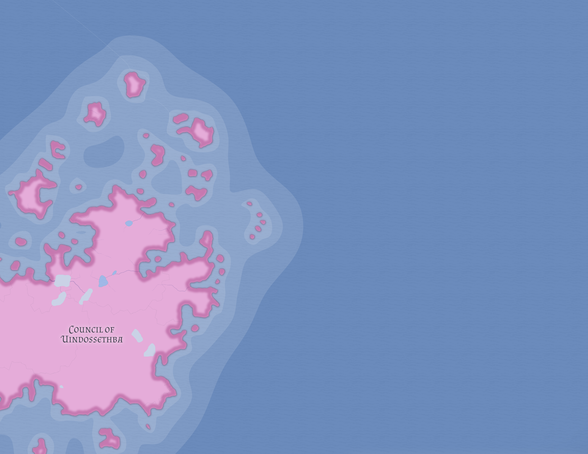

# Golsta

Golsta is the southeastern continent and the most inhospitable major landmass in the known world. Much of it lies under permanent ice or permafrost, while its mountainous interior sharply limits travel, settlement, and agriculture.

## Geography

Habitable zones are restricted to certain coasts and lower valleys. These conditions prevent agriculture at any significant scale and make large humanoid settlement effectively impossible.

Golsta is therefore less a conventional civilizational continent than a vast cold wilderness with only narrow margins of practical habitation.

## Dragons

The continent's greatest importance lies in its dragon populations. Golsta holds the largest surviving concentrations of dragons in the known world, especially white and silver dragons adapted to glacial and subpolar environments.

## Related

- [Dragons](../peoples/dragons.md)
- [World of Eutheria](world-of-eutheria.md)
