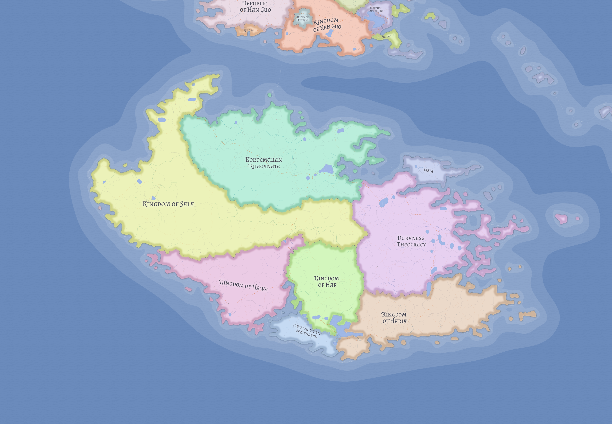

# Kasmora

Kasmora is the southwestern continent of Eutheria and the most agriculturally productive major inhabited landmass in the known world. Its deep alluvial soils, major river systems, broad plains, and productive coasts make it the demographic center of the world, but not a unified one. Kasmora's defining political pattern is enduring coexistence among multiple major powers rather than stable continental empire.

## Geographic structure

A northern mountain belt separates the coast from major interior plains and helps divide maritime zones from agrarian heartlands. South of that barrier, river systems and fertile lowlands sustain very large rural populations. Settlement in Kasmora is overwhelmingly agrarian, distributed across valleys, plains, irrigated regions, and productive coastal corridors rather than concentrated in a small number of dominant urban cores.

This geography creates both strength and plurality. Kasmora is rich enough to sustain several powerful states at once, and broad enough that none has been able to rule the entire continent durably.

## Political system of the continent

Kasmora's continental order is not chaotic. It is structured by the coexistence of states occupying distinct ecological, strategic, and civilizational niches.

The [Commonwealth of Sipharan](../states/sipharan.md) acts as a neutral institutional and educational center deeply tied to [Rawranism](../religions/rawranism.md).

The [Kingdom of Har](../states/har.md) is a stable Rawran monarchy associated with durable kingship, inland productivity, and high-quality manufacture.

[Haria](../states/haria.md) is the principal Berber kingdom and a major southeastern coastal power.

The [Kingdom of Hawa](../states/hawa.md) is the premier Arabic maritime trading kingdom of the continent.

[Sala](../states/sala.md) combines sacred geography with grain wealth and pilgrimage infrastructure, making it both a breadbasket and a religious center.

[Kordemeli](../states/kordemeli.md) is a major northern land empire whose authority stretches across multiple subject populations.

The [Dukanese Theocracy](../states/dukan.md) is a large coercive clerical state whose ideological claims exceed the stability of its actual position.

[Likia](../states/likia.md), though territorially smaller, shapes the maritime order of Kasmora by controlling the strait system linking the continent to wider intercontinental trade.

## Religion and political consequence

Kasmora's religious geography is politically active, not merely descriptive.

Ayedism gives Sala soft power through control of access to sacred Tuwaid and the institutions that sustain pilgrimage movement.

Delistanism appears in markedly different political forms. In Haria it is predominantly community-led and non-theocratic. In Dukan it is fused to coercive clerical sovereignty and ideological expansionism.

Rawranism shapes both republican Sipharan and monarchical Har, demonstrating that a shared religious tradition can support more than one constitutional order when deeper civilizational commitments remain aligned.

## Why Kasmora does not unify

No power has maintained durable rule over the whole continent because Kasmora's abundance does not translate into simple centralization. Its populations are too large, its regional systems too well-developed, and its strategic centers too diverse to be absorbed permanently by a single regime.

Agrarian interiors, pilgrimage routes, maritime corridors, frontier mountain zones, and institutional centers each produce their own kinds of leverage. A power strong in one arena is rarely supreme in all of them at once. Continental politics therefore tend toward balancing, rivalry, limited hegemony, and negotiated coexistence rather than final unification.

## Historical character

Kasmora is the clearest example in Eutheria of a world region where abundance produces plural power instead of imperial simplicity. Its states compete, align, and pressure one another continuously, but the continent remains structurally multipolar.

That makes Kasmora both one of the richest regions in the world and one of the most politically consequential. Whoever wishes to understand the balance of power in Eutheria must understand Kasmora, whose demographic and economic weight makes it a quietly emerging center of gravity.

## Related

- [World of Eutheria](world-of-eutheria.md)
- [Central Island Chain](central-island-chain.md)
- [Biomes of Eutheria](biomes-of-eutheria.md)
