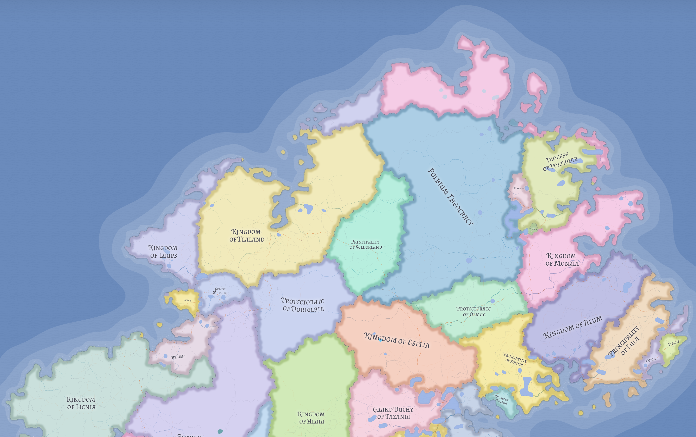

# Nereth

Nereth is the northeastern continent of the known world and the most demographically significant landmass in Eutheria. Its broad river plains, mountain barriers, and layered urban infrastructure make it both politically central and structurally divided.

## Geography

Nereth contains broad lowland river systems, several major mountain ranges, and some of the highest peaks in the known world. One major range acts as a hard divide between the old eastern heartland and the western coastal regions.

The continent's western fringe is increasingly important because the eastern post-imperial order remains unstable and the mountain approaches now matter more to trade than the older southern maritime route once did.

## Peoples and regions

Nereth is home to many peoples, including Flandric, Veltric, Monzian, Alaian, Sinzian, Lienian, Fernish, Olmagan, Westric, and Dwarven populations. That diversity is reflected in its religious and political patchwork.

The western coast is dominated by [Lienia](../states/lienia.md), [Sinz](../states/sinz.md), [Fresen](../states/fresen.md), [Bramia](../states/bramia.md), [Garka](../states/garka.md), and [Laups](../states/laups.md). The east remains shaped by Veltric successor politics, above all the claims of the [Polbium Theocracy](../states/polbium-theocracy.md) and the weakening authority of the [Rocciaganel Church](../religions/rocciaganel-church.md).

## Historical weight

Nereth carries the deepest institutional legacy of the Veltric world. Much of its urban and road infrastructure survives from imperial times even though the political order that built it collapsed one hundred and fifty years ago.

That leaves the continent in a distinctive condition: materially advantaged, institutionally layered, and politically unsettled.

## Related

- [Eastern Nereth Religious Landscape](../religions/eastern-nereth-religious-landscape.md)
- [Lienia](../states/lienia.md)
- [Polbium Theocracy](../states/polbium-theocracy.md)
- [Present Day (1026 LC)](../history/present-day-1026-lc.md)
- [Sinz](../states/sinz.md)
- [Western Maritime Nereth](western-maritime-nereth.md)
