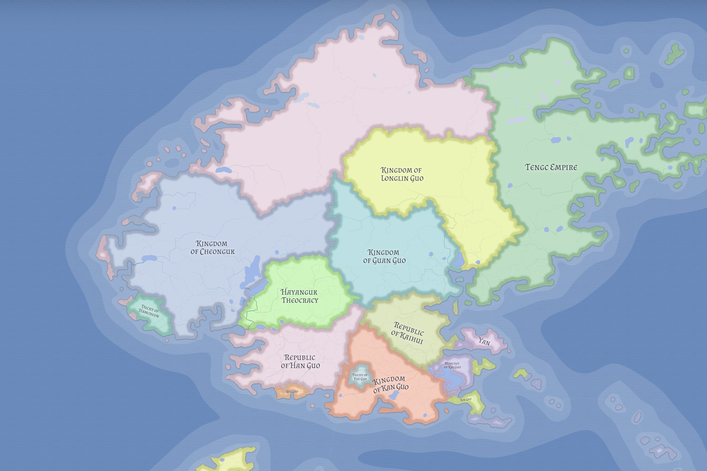

# Valthera

Valthera is the northwestern continent of Eutheria, shaped by cold northern extremes, lake-rich interiors, rugged uplands, and politically divided lowland cores. It is one of the world's major civilizational theaters, but one that has resisted lasting continental unification.

## Physical character

Valthera combines severe and temperate zones in a single connected system. The far north is glacial and subarctic, while the south and southeast open into forests, plains, wetlands, and productive agricultural basins.

Its most defining structural feature is inland water. Lakes, branching rivers, and broken coastlines are primary trade and movement arteries, not secondary geography.

Central uplands and mountain systems divide the continent into connected regional worlds. These barriers create corridors, chokepoints, and defensible frontiers that make consolidation difficult and regional power durable.

## Settlement and economy

Dense settlement clusters in southern lowlands, river valleys, lake margins, and coastal belts. Northern zones are more sparsely inhabited, while interior uplands support fortified settlements, mining communities, and pass-oriented strongholds.

Because of this geography, Valtheran exchange relies heavily on waterways. Control of harbors, river mouths, lake routes, and internal corridors is often more important than raw land area.

## Civilizational structure

Valthera is organized around three major cultural blocs:

- Chinese-analog polities in much of the south, east, and northeast
- Korean-analog states concentrated in the west
- Dwarven highland populations occupying key interior mountain systems

These blocs create a contact-continent pattern. Political life is shaped by sustained interaction across boundaries, not by sealed civilizational zones.

Valthera is the world's main East-Asian analog field, but it is not politically uniform. Settled Chinese-analog states, Korean-analog western systems, frontier horse cultures, and upland dwarven intermediaries all occupy durable positions inside the same continental frame.

## Religion and frontier contact

Western and central uplands are active exchange frontiers where religion, culture, and state formation overlap. Traditions associated with [Hayanguk](../states/hayanguk.md) and the [Tongj Apostates](../religions/tongj-apostates.md) illustrate how long-duration Korean-Dwarven contact can produce distinct religious developments.

Valthera is therefore not best read as neatly separated faith regions. Mountain frontiers are zones of reinterpretation, selective synthesis, and recurring tension.

## Political pattern

Valthera is fragmented but not weak. It contains multiple major states, yet no durable continental hegemon. This pattern reflects geography more than civilizational stagnation: waterways create rival power centers, mountain systems hinder inland consolidation, and ethnocultural distribution complicates absorption.

Its politics usually take the form of balancing, rivalry, and regional spheres of influence rather than continental empire.

The continent is best read through three broad political zones:

- **Western Valthera**, shaped by the Korean kingdoms and the Chinese-Korean sacred compact
- **Central and Northern Chinese Valthera**, shaped by lakes, rivers, frontier distance, and uneven maritime access
- **Eastern and Southeastern Valthera**, shaped by treaty corridors, coastal outlets, clerical influence, plains wealth, and the remembered destruction of Xin Guo

This pattern is also visible in mixed and layered polities such as [Han Guo](../states/han-guo.md), confessional monarchies such as [Cheonguk](../states/cheonguk.md), defensive frontier theocracies such as [Hayanguk](../states/hayanguk.md), river-gate kingdoms such as [Guan Guo](../states/guan-guo.md), plains republics under postwar constraint such as [Kaihui](../states/kaihui.md), more straightforward landed monarchies such as [Kan Guo](../states/kan-guo.md), treaty-managed outlet states such as [The Marches of Kai Guo](../states/kai-guo.md), minor coastal duchies such as [Yan](../states/yan.md), upstream frontier monarchies such as [Longlin Guo](../states/longlin-guo.md), old confederated imperial orders such as [Tengc](../states/tengc.md), small defensive duchies such as [Hamcheon](../states/hamcheon.md), and sacred-sovereign centers such as [Quz Guo](../states/quz-guo.md), where legitimacy and institutional form do not map neatly onto single-ethnicity state models.

## The Likian constraint

Valthera's external strategic ceiling is set by [Likia](../states/likia.md) and the strait order around the [Central Island Chain](central-island-chain.md). Southern maritime supremacy remains constrained by this order, even for strong Valtheran naval states.

This pressure redirects competition inward and sideways: internal water control, border rivalry, proxy influence, and corridor dominance matter more than open bids for oceanic mastery. In the east and southeast, no polity can be understood in isolation from the wider littoral system shaped by Kaihui, Kan Guo, the See of Xin Guo, the Marches of Kai Guo, Yan, and the memory of destroyed Xin Guo.

## Historical character

Valthera has deep historical memory, but its modern political form is better explained by enduring structure than by any single ancient event. Terrain, civilizational distribution, and maritime limits remain the best guides to understanding the continent in 1026 LC.

## Related

- [Biomes of Eutheria](biomes-of-eutheria.md)
- [Central Island Chain](central-island-chain.md)
- [Duchy of Hamcheon](../states/hamcheon.md)
- [Eastern and Southeastern Valthera](eastern-southeastern-valthera.md)
- [Guan Guo](../states/guan-guo.md)
- [Han Guo](../states/han-guo.md)
- [Hayanguk](../states/hayanguk.md)
- [Kaihui](../states/kaihui.md)
- [Kan Guo](../states/kan-guo.md)
- [Kasmora](kasmora.md)
- [Kingdom of Cheonguk](../states/cheonguk.md)
- [Likia](../states/likia.md)
- [Longlin Guo](../states/longlin-guo.md)
- [Nereth](nereth.md)
- [Quz Guo](../states/quz-guo.md)
- [Tengc](../states/tengc.md)
- [The Marches of Kai Guo](../states/kai-guo.md)
- [Tongj Apostates](../religions/tongj-apostates.md)
- [World of Eutheria](world-of-eutheria.md)
- [Yan](../states/yan.md)
