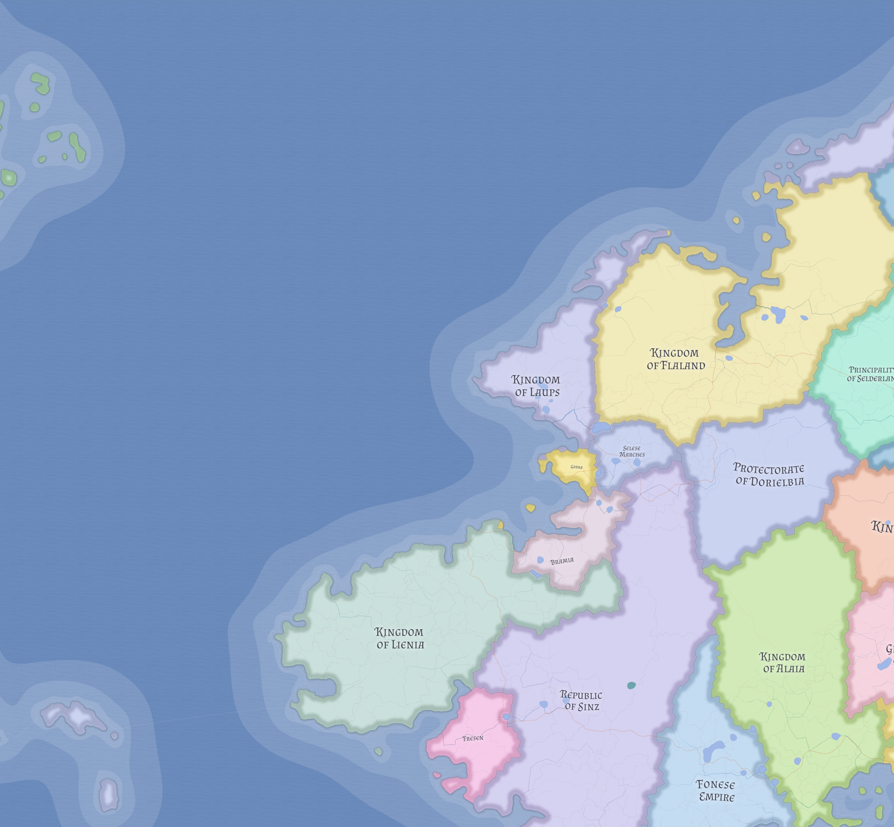

# Western Maritime Nereth

Western Maritime Nereth is the rising commercial west of the continent, where oceanic trade becomes inland trade and where the post-Veltric commercial realignment has elevated once-peripheral states into new prominence.

## Regional role

This region is anchored by the western sea-gate monarchy of [Lienia](../states/lienia.md), the harder inland-commercial republic of [Sinz](../states/sinz.md), the dynastic littoral remnant of [Fresen](../states/fresen.md), and the transfer duchy of [Bramia](../states/bramia.md). Farther north, [Garka](../states/garka.md) and [Laups](../states/laups.md) mark the transition into a more openly Flandric coastal and upland world.

Its importance comes from ports, estuarial customs, river interfaces, corridor control, and the landward routes that now matter more because the old eastern southern shipping chain never fully recovered.

## Political pattern

The region is commercially intense but not uniformly centralized. Strong states dominate important nodes, while interior seams and thinner-control regions still leave room for local variation and lower-intensity danger.

Western Maritime Nereth also differs sharply from the eastern successor lands. Its rivalries are real, but they are usually disputes inside a functioning western system rather than existential contests over imperial inheritance.

## Related

- [Bramia](../states/bramia.md)
- [Dudbury](dudbury.md)
- [Fresen](../states/fresen.md)
- [Lienia](../states/lienia.md)
- [Rombevenia](rombevenia.md)
- [Sinz](../states/sinz.md)
