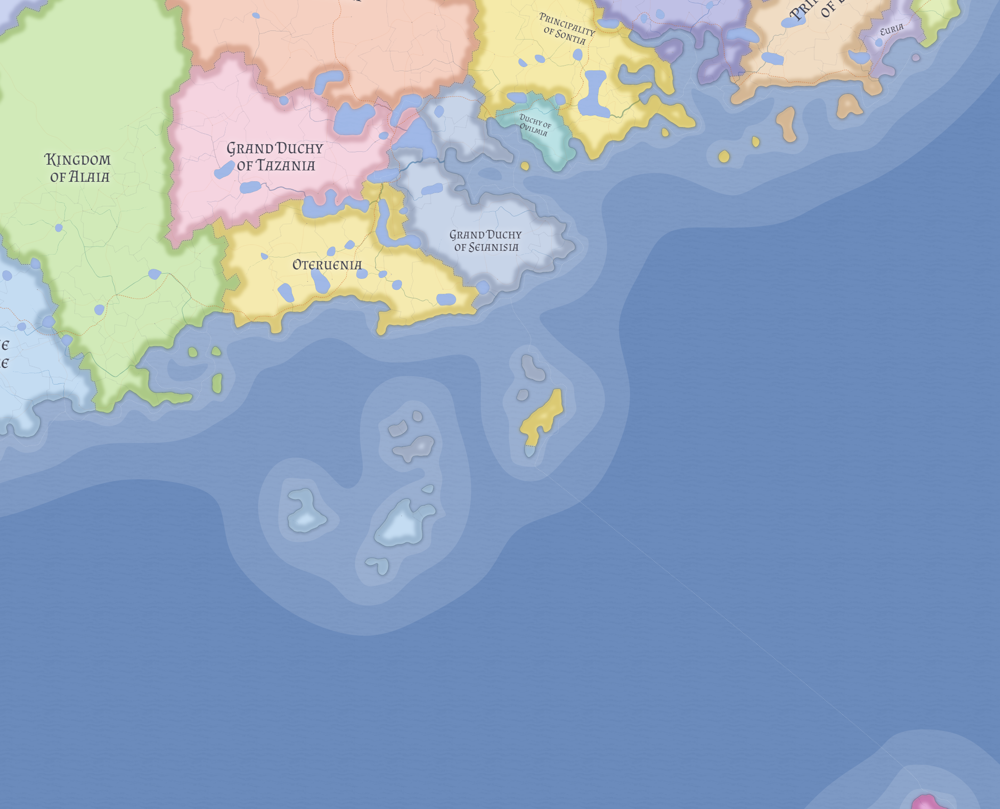

# Alaia

Alaia is the principal mainstream monarchy of the Alaian world: a Brinese-majority Alaian crown kingdom shaped by imperial contact without ever being fully absorbed into the Veltric order.

## Core identity

Alaia shares much of its cultural and religious texture with the [Fon](fon.md), but is more formalized, more title-conscious, and more clearly organized around a real king. Imperial influence reached the kingdom strongly enough to shape institutions and strategic orientation, but not so completely that Alaia lost its native language or deep social identity.

Its capital is **Paga**, the easternmost major non-imperial capital before the old imperial world. The kingdom's principal eastern strongpoint is **Etxetaharri**, a gate city and military-academic center tied to the old anti-imperial frontier order.

## Politics and offices

Alaia is hierarchical without being deeply feudal. Most nobles are small-landed rather than great magnates, while many commoners are freeholders or live under local authorities whose subordination to a lord is often more formal than practical. The king remains the recognized source of lawful rank, and the crown's authority is reinforced through circuit courts that carry petitions, grievances, and disputes beyond the safe competence of villages or local lords.

The monarchy functions through a compact but meaningful set of crown offices. The **Etxezaina** oversees royal household provisioning and crown lands; the **Epaile Nagusia** supervises the higher judicial order and circuit courts; the **Mariskala** maintains military coherence; the **Zigiluzaina** controls confirmations, grants, and documentary finality; the **Zaindaria** oversees the Great Highway; the **Komandantea** commands Etxetaharri and its eastern district; and the **Akadamiaburua** heads the military academy there and preserves Alaia's officer-training tradition.

## Economy, society, and defense

Alaia's material strength rests on productive agrarian belts, internal resources, and crown control of the **Great Highway**, one of the important southern routes that can bypass the dwarven toll passes. Iron, timber products, stone, and a minor crown-controlled gold industry all contribute to the kingdom's durability.

Socially, Alaia is more respectful of monarchy than of local lordship, and the circuit-court system helps preserve that balance. Militarily, the kingdom is the diminished but durable descendant of an older anti-imperial frontier system, now oriented toward preventing eastern instability from bleeding west into Alaian territory.

## Religion and external position

Alaia belongs to the broader Alaian religious world, but it should not be read simply as an Altavist state. The kingdom is better understood as Brinese-majority in public social character while still participating in the wider [Altavist](../religions/altavism.md) religious sphere. This distinguishes it from more explicitly institutionalized Alaian church variants.

Its warmest external relationship is with the [Fon](fon.md). Relations with Tazania and Oteruenia remain less sharply defined in current public coverage, while direct relations with [Sinz](sinz.md) are limited by intervening dwarven-held lands.

## Related

- [Altavism](../religions/altavism.md)
- [Brinese Order](../religions/brinese-order.md)
- [Fon](fon.md)
- [Sinz](sinz.md)
