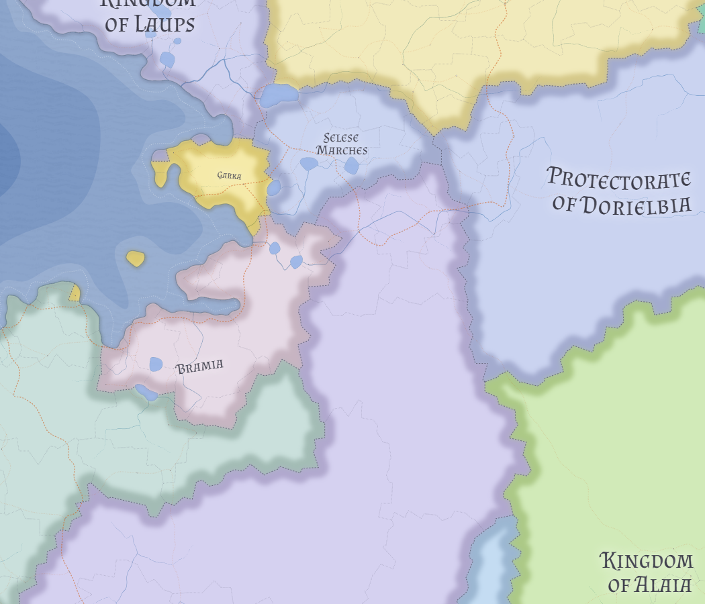

# Bramia

Bramia is an ancient English grand duchy whose economy and historical importance are rooted in the river-mouth and lake-chain system opening onto its coast, making it a transfer state between central-ocean shipping, the Norse-facing north, and the upper inland routes leading toward Sinz's northeastern foreland.

## Core identity

Bramia is not a Lienian split-state or dynastic leftover. It is an old state with an independent history and its own route logic.

It is traditionally English in political identity and present-state cultural center, but it has long functioned as a crossroads between English and Norse worlds. Its distinctiveness lies in being a compact transfer duchy rather than a large sea-gate monarchy or a broad inland corridor republic.

## Geography

Bramia occupies a coastal-interior hinge north of Lienia, where sea access, an articulated littoral, inland waters, and overland approaches converge.

The river-mouth and associated lake-chain opening into Bramian waters form the structural heart of the duchy's economy. **Holterden** should be understood as the ducal control point of that hinge system rather than only the duchy's largest port.

## Economy and long-term role

The core of Bramia's economy is transshipment from ocean shipping into river-and-lake transport, together with relay trade, warehousing, harbor service, and ordinary agrarian support from its hinterland.

Before Lienia's maritime rise, Bramia was a more important transit and exchange state linking southern shipping, the Norse north, and inland movement toward the northeast. Lienia reduced Bramia's relative prominence, but did not erase its usefulness, because the Bramian river-mouth system remained a natural transfer interface.

## Society and foreign posture

Though traditionally English, long Norse contact should be visible in port custom, seafaring culture, and coastal habits more than in a present-day demographic split. Bramia appears religiously cohesive and conventionally Skrosenist, with religion functioning as locally embedded social glue rather than political crisis.

Its foreign posture is cautious, orderly, and self-respecting: a state that survives by being useful, legible, and worth preserving rather than by dominating larger neighbors.

## Regional faces

- **Holterden and the ducal harbor core**, the governing and administrative hinge of the duchy
- **the river-mouth and articulated littoral**, the outward-facing economic heart of Bramia
- **the service interior**, the productive support belt linking coast, inland waters, and overland routes

## Related

- [Lienia](lienia.md)
- [Sinz](sinz.md)
- [Western Maritime Nereth](../geography/western-maritime-nereth.md)
