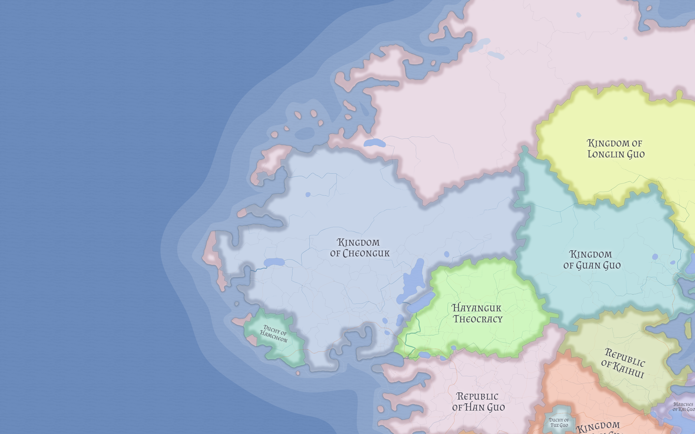

# Cheonguk

Cheonguk is the largest Cheoni kingdom in western Valthera and the clearest mainstream Cheoni anchor state of the region. It is large, coastal, politically self-assured, and dynastic rather than frontier-defined.

## Character

Where [Hayanguk](hayanguk.md) represents the defensive inland frontier and [Han Guo](han-guo.md) a mixed republican compact, Cheonguk represents conventional major-power Cheoni kingship.

Its current capital is **Eoyangwan**.

Cheonguk is strong enough to be formal and controlled rather than anxious. It presents itself as a respectable guardian of order and mainstream Cheoni legitimacy.

## Religion and territorial settlement

Cheonguk is culturally unified but not religiously simple. Its older core is best understood as Dedeokan, while Tongj regions appear to be later frontier acquisitions. The kingdom treats those lands as settled possessions under territorial toleration rather than as provisional occupation, which helps explain its asymmetrical relationship with Hayanguk.

## Coast and power

Cheonguk's broad maritime frontage and multiple ports make it more outward-facing than inland Hayanguk, but it remains a kingdom rooted in land, dynasty, and territorial order rather than in maritime republicanism.

## Related

- [Hamcheon](hamcheon.md)
- [Hayanguk](hayanguk.md)
- [Valthera](../geography/valthera.md)
