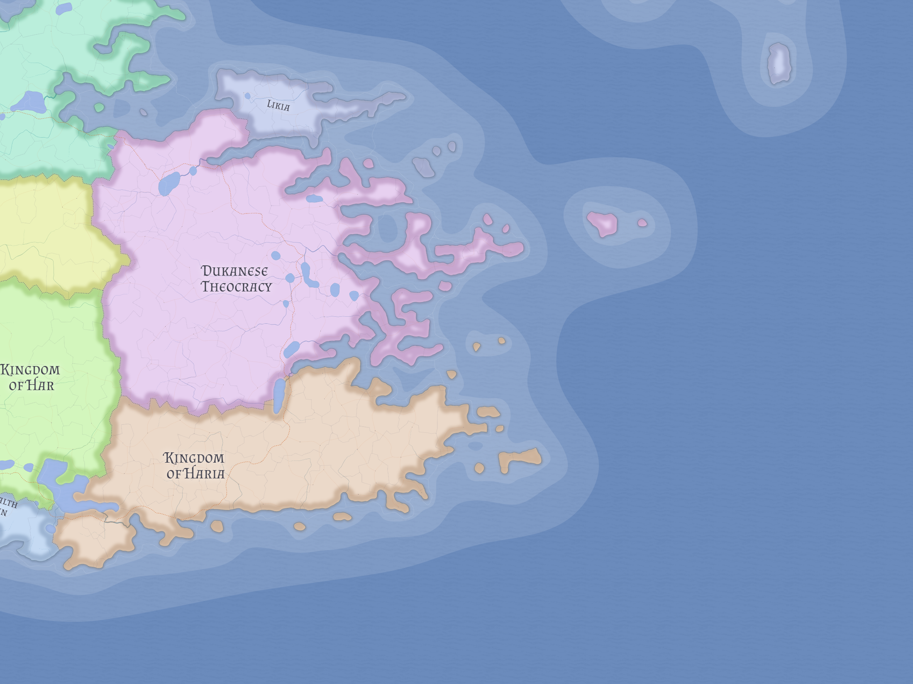

# Dukanese Theocracy

The Dukanese Theocracy is a large Kasmoran state in which political and religious authority are merged under the Hierophant. It is both a major continental power and one of the clearest examples of religion becoming state form.

## Political order

Around 826 LC, kingship was absorbed into the office of the Hierophant. Since then, Dukan has been governed as a theocracy with no meaningful distinction between the supreme religious and political roles. This gives the state a public character very different from its neighbors even when its underlying social fabric remains older and more layered than the regime's official theology suggests.

## Religion and internal tension

Dukan's state religion is [Delistanism](../religions/delistanism.md), which presents itself as the fulfillment of older Dukanese tradition. That claim is rejected both by Dukanese revivalists who want the ancestral folk religion restored and by Likian Skrosenist communities absorbed after Dukan's costly war with [Likia](likia.md). These tensions mean the Theocracy is not merely a unified religious state, but a polity actively trying to make its official sacred order stick across populations that do not all accept it on the same terms.

## Regional importance

Dukan matters because it is both large and ideologically structured. It stands as one of the major Kasmoran powers, but also as a case study in how state religion can absorb monarchy, redefine legitimacy, and still leave unresolved questions beneath the official order.

## Related

- [Delistanism](../religions/delistanism.md)
- [Haria](haria.md)
- [Kasmora](../geography/kasmora.md)
- [Likia](likia.md)
