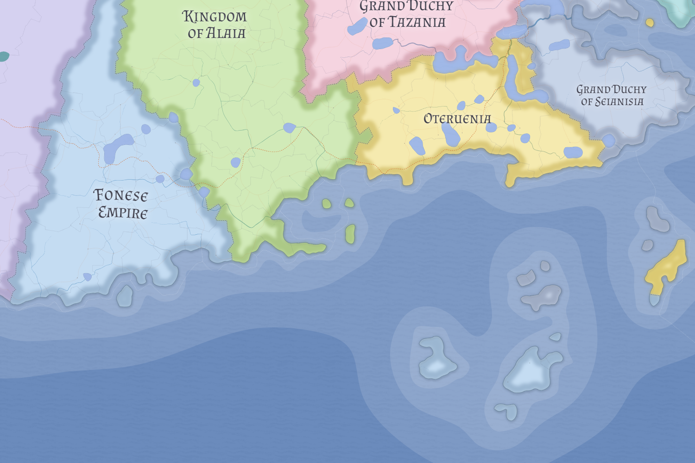

# Fon

The Fon is a lightly settled Alaian confederated land-sphere whose political unity is identified with the land itself rather than with dense central administration. It should not be understood as an empire.

## Political character

The Sotenar of the Fon holds a chief coordinating office tied to the common city of Sotenadabue, but authority remains thin and focused on what the confederation actually shares: roads, tolls, trade, and limited inter-tribal coordination.

The Fon should not be understood as an empire or dense monarchy. Its political order is territorial, customary, and locally entrenched. Most daily governance remains with local rulers, chiefs, kings, and other sub-polity authorities rather than with a constantly present central state.

## Society and religion

The Fon is culturally Alaian and publicly Brinese in religious character. Its cohesion rests more in custom, territorial identity, and shared sacred practice than in hard bureaucracy.

That structure fits the land itself. The Fon is difficult to centralize not because it lacks politics, but because its communities are deeply rooted and the returns on conquest or heavy administration are poor. Large-scale warfare is rare, military obligation is organized through tribal quota, and economic life is mostly local and self-sufficient outside the common road and toll system.

To neighboring powers, the Fon matters less as a conquering threat than as a persistent cultural fact. Its importance to [Sinz](sinz.md) lies especially in the way it serves as a southern Alaian reference point for the republic's own Alaian populations.

## Related

- [Brinese Order](../religions/brinese-order.md)
- [Sinz](sinz.md)
