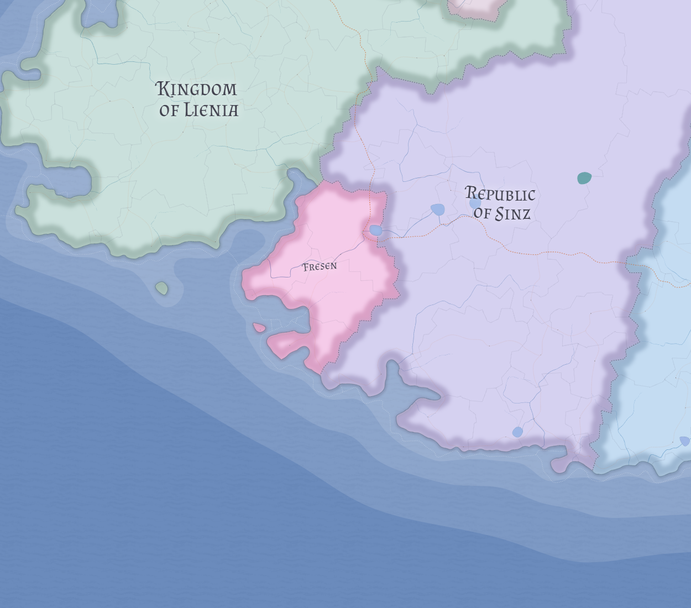

# Fresen

Fresen is a small German-led coastal grand duchy occupying the littoral hinge between Lienia and Sinz, sustained by moderate ports, a compact productive interior, and the inherited legitimacy of being the surviving coastal demesne of the old western kingdom from which republican Sinz emerged.

## Core identity

Fresen is not a third western great power alongside Lienia and Sinz. It is a secondary but durable western state whose identity rests on dynastic continuity, coastal usefulness, and respectable survival rather than large-scale strategic dominance.

It should be understood as the coastal dynastic remnant of the pre-934 western kingdom rather than as a random petty survivor.

## Geography

Fresen occupies the coastal hinge west of Sinz and south or southwest of Lienia's main maritime body, with an indented shoreline and several moderate littoral openings rather than one overwhelming harbor complex.

Its capital, **Guhauben**, should be understood as an inland-administrative ducal center rather than simply the largest port of the realm. The duchy's scale is compact enough to be governable as a personal state, but large enough to feel proper and sovereign rather than petty.

## Economy and society

Fresen's economy rests on ordinary agrarian support from its compact interior together with fisheries, harbor labor, medium-scale coastal traffic, and local intermediation within the western littoral rather than on major customs hegemony.

The state is German-led at the ducal core but includes a meaningful southern littoral Castillian layer that should be treated as a real coastal face without being inflated into a full dual-state crisis. Publicly, Fresen should feel proper, cautious, and quietly proud: more local and dynastic than either Lienia's maritime crown order or Sinz's magistratic republic.

## Historical position

Fresen survives because it was the ruling house's western coastal personal demesne at the time of the old western kingdom's collapse. In **934 LC**, the larger inland body broke away and reorganized as [Sinz](sinz.md), while Fresen endured as the sovereign dynastic residue of the old order.

Its grand-ducal standing should be understood as preserved sovereign dignity after the loss of the larger kingdom, not as evidence that it remained a reduced kingdom still claiming royal parity.

## Foreign posture

To outsiders, Fresen appears respectable, useful, and durable: a secondary coastal duchy whose importance lies less in regional dominance than in old legitimacy, stable littoral function, and survivorship.

## Related

- [Lienia](lienia.md)
- [Sinz](sinz.md)
- [Western Maritime Nereth](../geography/western-maritime-nereth.md)
