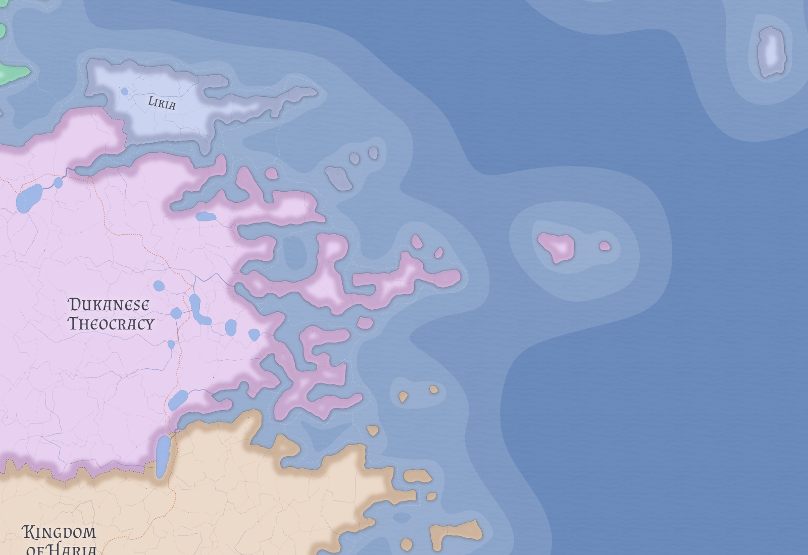

# Fuz Guo

Fuz Guo is an old semi-autonomous duchy enclosed within [Kan Guo](kan-guo.md). It is not best understood as a foreign sovereign state in practice, but as a privileged feudal holdout whose unusual hereditary rights survived later royal consolidation.

## Feudal status

The cleanest reading of Fuz Guo is historical rather than geometric. It appears to be an old marcher or allied ducal house that later became enclosed by expanding royal territory without losing its ancient chartered privileges.

Fuz Guo therefore owes homage to the King of Kan Guo while retaining unusual internal autonomy, noble prestige, and local distinctness. Its center is **Zhang**.

## Sorcerous nobility

Fuz Guo's noble houses are defined by hereditary sorcerous prestige. Their claim is blood-based in the Pathfinder sense, not rooted in learned wizardly scholarship.

In earlier centuries, those bloodlines seem to have produced more formidable sorcerers than they do in the present. In the current age, the blood has been diluted by time and intermarriage, and truly powerful sorcerers are rare. Minor manifestations, weak gifts, unstable talents, or no obvious magical expression at all are now more common than major power.

## Prestige without domination

Fuz Guo should not be treated as an overpowering mage-state. Its reputation is stronger than its average magical reality.

That surviving reputation still matters politically. The old blood remains one of the reasons the duchy can preserve autonomy and status inside a larger monarchy that might otherwise have absorbed it completely.

## Place within Kan Guo

Fuz Guo helps signal that Kan Guo is an old feudal kingdom rather than a perfectly regularized crown domain. Its continued distinctness marks the survival of older privilege inside later consolidation.

## Related

- [Kan Guo](kan-guo.md)
- [Valthera](../geography/valthera.md)
