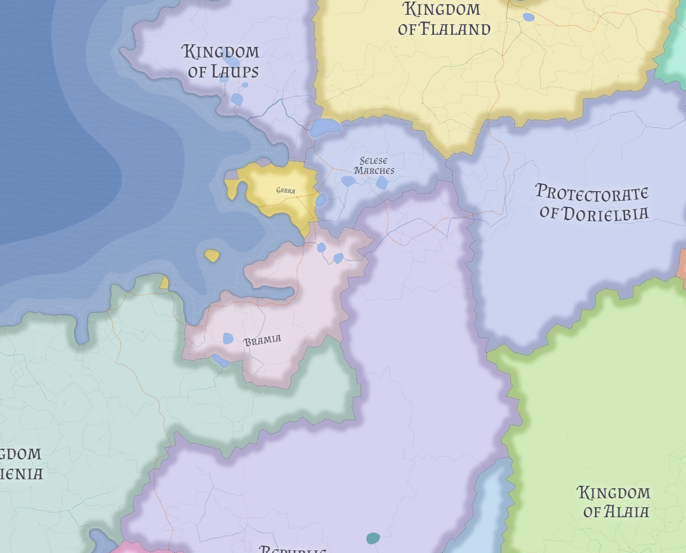

# Garka

Garka is a tiny Nordic coastal polity on the northwestern edge of western Nereth. Foreign powers often render it as the "Duchy of Garka," but internally it remains a tribal-sacral Four Winds polity whose cohesion, defensibility, and low annexation value have helped it endure.

## Geography and identity

Garka occupies a small rugged littoral pocket north of [Bramia](bramia.md), centered on a sheltered fortified harbor and a narrow coastal-interior body rather than a broad inland territory.

Its economy is modest and local rather than expansive. Fishing, timber, forest products, harbor labor, and limited local dues matter more than large-scale trade or agrarian depth.

Garkan identity is firmly Nordic and strongly Skrosenist. Garkans place real weight on the belief that no Norse people have ever been permanently ruled by non-Norse powers and treat that continuity as evidence of divine favor.

## Four Winds order

Every Garkan belongs by birth to one of the Four Tribes, known together as the Four Winds. Most daily political life remains communal, local, and tribal rather than centrally administered.

The tribal elders act together chiefly when intertribal coordination is required, especially for common defense, settlement of disputes between tribes, and management of shared obligations owed on behalf of Garka as a whole.

## Sacred rulership

The sacred ruler is the **Godbrodir**, or **Godsystir** when a woman holds the office. The position is held for life and understood as a burden of divine selection rather than a prize to be sought openly.

When the office falls vacant, the elders of the Four Winds gather after an interregnum and choose by lot. The chosen elder is expected to accept the office whether willing or not.

Challenges to a reigning ruler are tightly constrained. A challenger must first secure majority support in the council of elders of each tribe, which makes formal challenge possible but rare.

## Foreign posture

To outsiders, Garka can look rustic, stubborn, and politically archaic. In practice, it survives because abolishing it would yield little material gain while provoking disproportionate local resistance.

Its external posture is therefore less one of great-power ambition than of hard-edged communal endurance. Surrounding states may find Garka useful to deal with, but not worth the trouble of trying to absorb.

## Related

- [Bramia](bramia.md)
- [Laups](laups.md)
- [Western Maritime Nereth](../geography/western-maritime-nereth.md)
