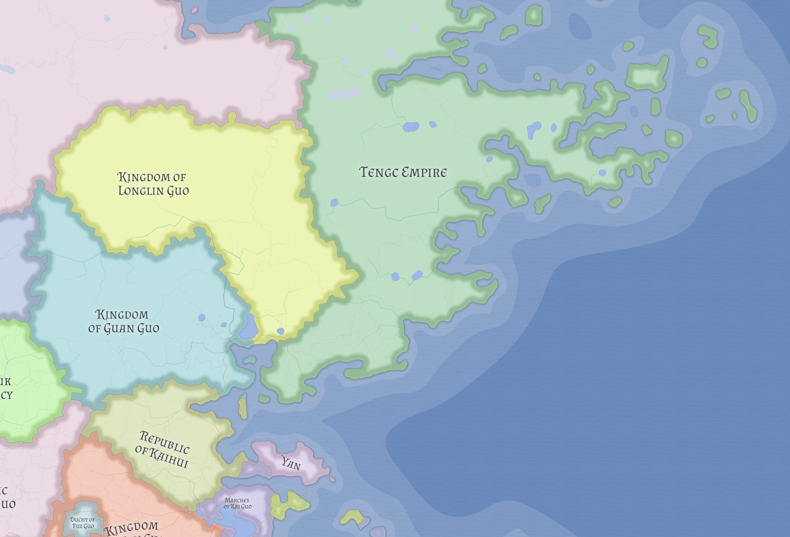

# Guan Guo

Guan Guo is a cohesive Chinese kingdom in western Valthera whose importance comes from position more than spectacle. It is best understood as a river-gate toll kingdom built around control of a major inland-to-sea water system.

## Geographic position

Guan Guo occupies a central position in western Valthera between several important neighboring powers. It borders [Longlin Guo](longlin-guo.md) to the north, [Tengc](tengc.md) to the east, [Kaihui](kaihui.md) to the south and southeast, [Han Guo](han-guo.md) to the southwest, and [Hayanguk](hayanguk.md) to the west and southwest.

The kingdom is organized around a major river system that runs through much of its territory before reaching the sea near the capital, **Xuzhoubin**. Guan Guo does not control the entire river, but it appears to hold some of the most valuable stretches: lower and middle reaches, reentry points, and the outlet to the coast.

## Bay and outlet

Guan Guo's strategic weight is sharpened by the sheltered bay into which this river system empties. Longlin's inland river world, Guan Guo's lower-river customs zone, and [Tengc](tengc.md)'s eastern shore all converge there before traffic reaches the open sea.

Current canon suggests Guan Guo controls the most favorable transfer point between inland cargo and seaborne movement. Xuzhoubin sits on the most usable low shore at the river mouth, giving Guan Guo a natural advantage rather than a merely accidental political one.

## Economic character

Guan Guo is primarily a toll kingdom. Its power likely rests on:

- customs and tolls on river traffic
- bonded storage and warehousing
- river policing and escorted movement
- transshipment between inland and coastal routes
- control of the coastal outlet at Xuzhoubin

The kingdom also appears to possess a substantial grassland interior, giving it a productive agricultural and pastoral base alongside river commerce.

Its outlet advantage likely matters especially to [Kaihui](kaihui.md), whose broader coastline has never been developed into an equally effective maritime system.

## Naval and political character

Guan Guo is best understood as riverine and littoral rather than a blue-water maritime state. Its power comes from keeping movement predictable, taxable, and difficult to bypass.

That encourages an orderly, transactional, and quietly strategic political style focused on stable borders, practical agreements, customs enforcement, and river security.

## Cultural and religious profile

Guan Guo appears internally cohesive. It is culturally Chinese at both the state and settlement level, and its burgs are uniformly associated with the **Kaibeihuan Cult**.

This distinguishes it from more visibly mixed western Valtheran states such as [Han Guo](han-guo.md) and from confessional frontier states such as [Hayanguk](hayanguk.md).

## Place in Valthera

Guan Guo is one of the quieter but more structurally important states of western Valthera. It is neither a frontier theocracy nor a mixed republican experiment, but a prosperous Chinese monarchy whose strength lies in combining a productive interior with control over a strategic river corridor and the best natural outlet on a shared commercial bay.

## Related

- [Valthera](../geography/valthera.md)
- [Han Guo](han-guo.md)
- [Hayanguk](hayanguk.md)
- [Kaihui](kaihui.md)
- [Longlin Guo](longlin-guo.md)
- [Tengc](tengc.md)
