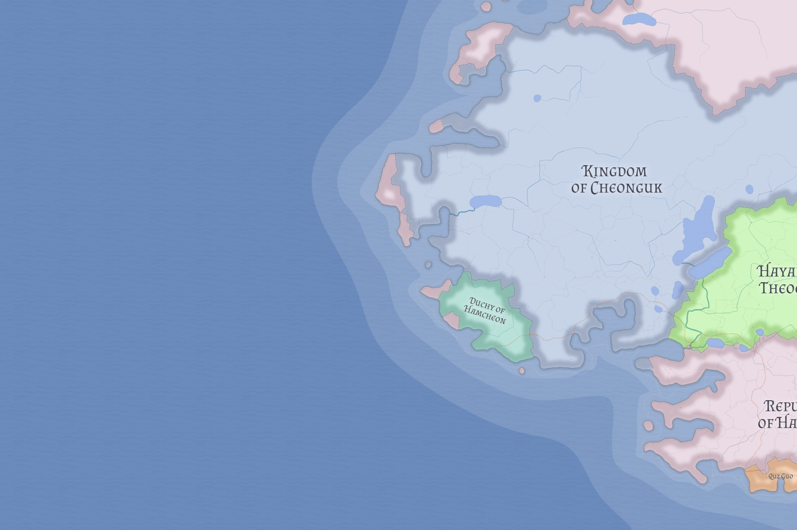

# Hamcheon

Hamcheon is a small Cheoni Dedeokan coastal duchy on the southwestern edge of Cheonguk. It survives less by power than by cohesion, fortification, and political modesty.

## Identity

Hamcheon is homogeneous in both culture and religion and unusually heavily fortified for a polity of its size. That fortification is part of its identity rather than a mere incidental feature.

## Related

- [Cheonguk](cheonguk.md)
- [Valthera](../geography/valthera.md)
