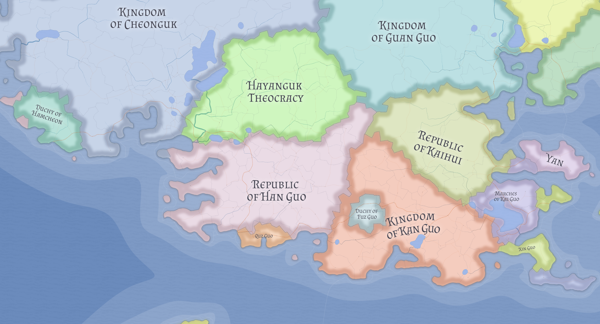

# Han Guo

Han Guo is a Chinese-classed republic in Valthera that functions in practice as a deeply integrated Chinese-Korean union.

Its legal and institutional profile is Chinese in aggregate classification, while its social composition is mixed and cohesive, with substantial bilingual overlap in urban and governing life.

## Political structure

Han Guo's governing order is republican and negotiated rather than conquest-driven.

A core interpretive feature is the capital arrangement: **Insan** is Korean, and that is treated as a foundational constitutional compromise rather than an anomaly. Han Guo therefore governs through Chinese institutional forms from a Korean political center.

## Formation context

Current canon places Han Guo's consolidated republican form in the post-Xin Guo war order. Chinese and Korean communities in this Valtheran region had strong incentives to combine political resources under shared institutions.

This framing presents Han Guo as a durable civic compact built from interdependent frontier communities. Economic pressure, competition with larger neighboring powers, and shared Taizhouist religious life all help explain why the union held.

## Territory and economy

Han Guo includes northwestern holdings that are better read as remote extraction outposts than as a second demographic core. These zones are sea-linked fringe territories beneath glacial margins.

The resulting territorial model is layered:

- dense mixed civic core
- peripheral resource zones integrated by maritime and administrative links

## Religion and legitimacy

Han Guo's legitimacy is tied partly to religious custodianship.

It protects [Quz Guo](quz-guo.md) and preserves Shang as a sacred Taizhouist center, treating this role as duty rather than mere convenience. Han Guo's Chinese civil character is expressed less through the ethnicity of its capital than through institutions, court culture, and its guardianship of Taizhouist sacred order.

## Regional relations

Han Guo operates in a western Valtheran system that includes [Hayanguk](hayanguk.md), [Cheonguk](cheonguk.md), [Hamcheon](hamcheon.md), and [Guan Guo](guan-guo.md), each representing different solutions to culture, religion, and state alignment.

## Related

- [Valthera](../geography/valthera.md)
- [Likia](likia.md)
- [Quz Guo](quz-guo.md)
- [Hayanguk](hayanguk.md)
- [Kingdom of Cheonguk](cheonguk.md)
- [Duchy of Hamcheon](hamcheon.md)
- [Guan Guo](guan-guo.md)
- [Taizhouism](../religions/taizhouism.md)
