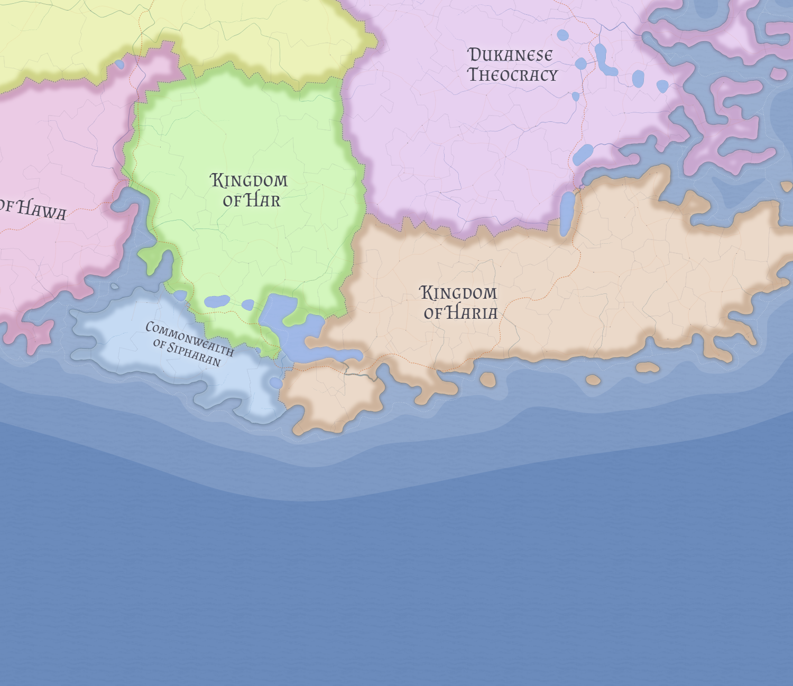

# Har

Har is a prosperous Rawran kingdom whose importance comes from internal resource wealth, stable ports, and a low-expansion, self-contained political character.

## Economy

Har exports inland wealth through several substantial gulf-facing ports. It is a producer and exporter rather than a transit power, and its low expansionism reflects a kingdom largely satisfied with what it already holds.

Its large ports relative to total population suggest significant internal resource wealth rather than imperial ambition. Har's economy is most plausibly built on exporting what it produces from within rather than taxing movement between other powers.

## Political tone

Har is a conventional feudal monarchy and a useful contrast to the much more unusual [Sipharan](sipharan.md), whose republican structure emerges from the same wider Rawran world.

The kingdom's significance lies partly in that contrast. Har and Sipharan share culture and religion, but not political form, which makes their continued coexistence one of the more interesting structural tensions in Kasmora.

## Related

- [Hawa](hawa.md)
- [Kasmora](../geography/kasmora.md)
- [Sipharan](sipharan.md)
