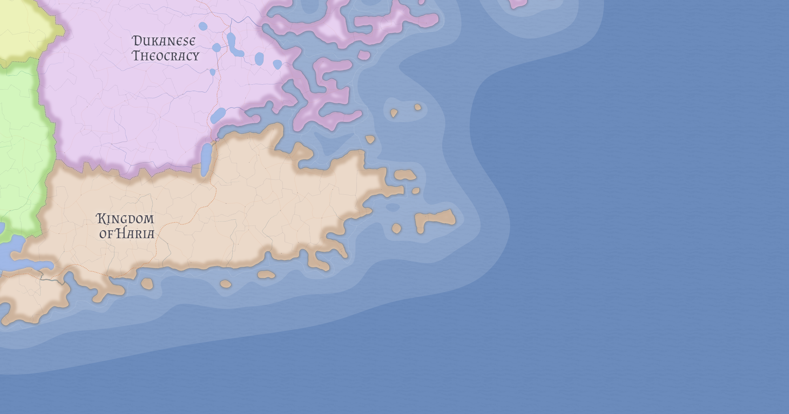

# Haria

Haria is the principal Berber kingdom of Kasmora and the foremost political center of Berber civilization in the inhabited world. It is a large and culturally cohesive state whose strength rests not only on territory and coastline, but on the fact that it stands as a civilizational core rather than a marginal regional power.

## Political character

Haria's identity is grounded in Berber centrality. It is not merely a kingdom with a Berber majority, but a state widely understood as the principal political expression of Berber civilization itself.

That gives Haria a kind of legitimacy different from states whose strength depends mainly on conquest or commercial advantage. Its authority is partly territorial, but also symbolic and cultural.

## Religion

Haria's dominant religion is Delistanism in a non-theocratic, community-led form. This is one of the clearest examples in Eutheria of how the same broader religious tradition can produce very different political outcomes depending on the institutions and civilizational habits that carry it.

Haria's Delistanism contrasts sharply with that of the [Dukanese Theocracy](dukan.md), where religion is fused to coercive clerical rule.

## Maritime and regional position

Haria holds a long southeastern Kasmoran coastline and exerts significant influence over southern sea routes. That maritime leverage matters especially because it affects the routes used by the [Kingdom of Hawa](hawa.md) to reach [Likia](likia.md) and the wider strait system.

Haria is therefore more than a large inland kingdom with a coast. It is a culturally central and regionally assertive power with direct influence over the terms of southern maritime movement.

Its relationship with Hawa is generally transactional: Harian waters and ports are key waypoints for Hawan trade moving toward Likia, giving Haria persistent negotiating leverage without requiring open conflict.

## Strategic significance

Haria's importance lies in the combination of civilizational weight, coastal reach, and religious distinction. It helps define what Berber power looks like in Kasmora while also serving as a counterpoint to more coercive political uses of Delistanism.

## Related

- [Kasmora](../geography/kasmora.md)
- [Kingdom of Hawa](hawa.md)
- [Dukanese Theocracy](dukan.md)
- [Likia](likia.md)
- [Berber Culture in Kasmora](../cultures/berber-culture-in-kasmora.md)
- [Berbers of Kasmora](../peoples/berbers-of-kasmora.md)
- [Kasmoran Religious Landscape](../religions/kasmoran-religious-landscape.md)
