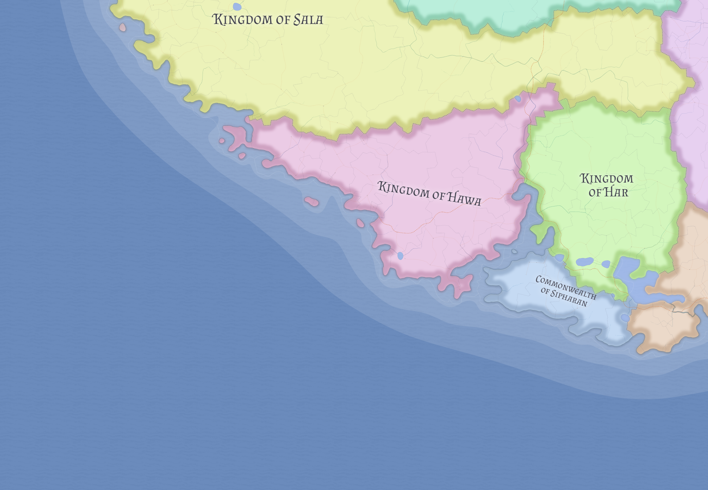

# Kingdom of Hawa

The Kingdom of Hawa is Kasmora's premier Arabic maritime trading kingdom. Its strength lies not in sweeping land conquest, but in ports, shipping, commercial coordination, and the institutions needed to turn sea access into sustained wealth.

## Political and economic character

Hawa is outward-facing, cohesive, and strongly oriented toward maritime exchange. Political and economic weight are concentrated in harbor cities, fortified ports, merchant networks, and the institutions that keep seaborne trade moving efficiently.

Its capital, **Ashaybar**, is both a major fortified port and the largest capital city in Kasmora (about 22,651 inhabitants), reflecting the degree to which Hawan power is concentrated in urban maritime infrastructure. See [Ashaybar](../places/ashaybar.md) for place-level detail.

Hawa's population is about 3.34 million across 37 burgs, with seven ports and a strongly maritime state profile.

## Maritime strategy

Hawa's expansionism (34.4) is primarily commercial. It seeks reach through trade, convoy organization, and influence over sea lanes rather than through broad continental annexation.

That makes Hawa one of the clearest examples in Eutheria of a state whose power is measured not by acreage alone, but by the volume, reliability, and strategic centrality of the routes it can command.

## Regional relationships

Hawa's southern access to [Likia](likia.md) depends on waters influenced by [Haria](haria.md). This gives Hawan diplomacy a persistent maritime realism. Even a strong trading kingdom must negotiate the fact that sea lanes pass through political space, not neutral emptiness.

Hawa is also closely comparable to [Sala](sala.md) as an Arabic Ayedist kingdom, though the two differ in emphasis. Their shared border is notably stable, with little structural friction and different maritime orientations.

## Strategic significance

Hawa matters because it converts maritime competence into regional weight. In a world where chokepoints, convoy routes, and customs corridors shape the balance of power, a disciplined seaborne kingdom can matter as much as a much larger land state.

## Related

- [Kasmora](../geography/kasmora.md)
- [Haria](haria.md)
- [Likia](likia.md)
- [Ashaybar](../places/ashaybar.md)
- [Sala](sala.md)
- [Kingdom of Har](har.md)
