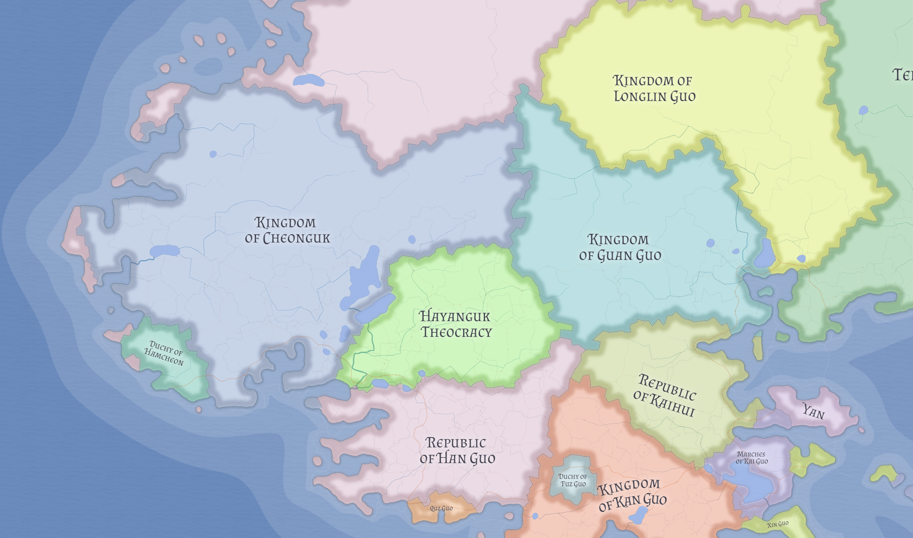

# Hayanguk

Hayanguk is a substantial inland Cheoni theocracy of western Valthera and one of the clearest hinge states of the region. It sits between Cheoni, Tengcian, and Dwarven spheres and has been shaped by a frontier religious synthesis that its neighbors regard with suspicion.

## Geography and role

Hayanguk has no open maritime access. Its significance comes from inland position, frontier pressure, and its role as a buffer between neighboring lowland states and rougher upland corridors.

## Religious identity

Its defining public religion is Tongj Apostatism, a Cheoni reinterpretation of Dwarven tradition blended with elements of the Witnesses of Dedeok. That makes the state not merely theocratic, but ideologically self-conscious and defensive.

## Related

- [Cheonguk](cheonguk.md)
- [Guan Guo](guan-guo.md)
- [Han Guo](han-guo.md)
- [Valthera](../geography/valthera.md)
