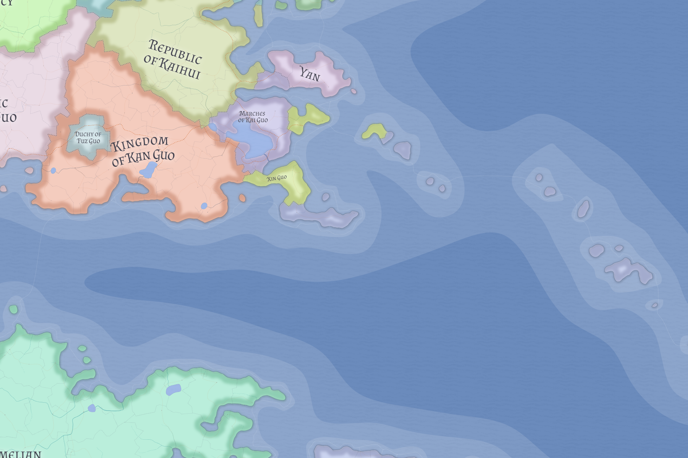

# Marches of Kai Guo

The Marches of Kai Guo are a small Tengcian littoral polity at a strategically sensitive coastal hinge between Kaihui, Kan Guo, Yan, and the Xin-facing offshore world.

## Political order

Kai Guo is not ruled by a monarch or popular assembly. Instead it is governed by a small bureaucratic council under a long-standing treaty order designed to keep an important southern outlet neutral, navigable, and defensible.

Its survival depends on remaining useful, balanced, and administratively competent.

## Related

- [Kaihui](kaihui.md)
- [Kan Guo](kan-guo.md)
- [See of Xin Guo](xin-guo.md)
- [Yan](yan.md)
