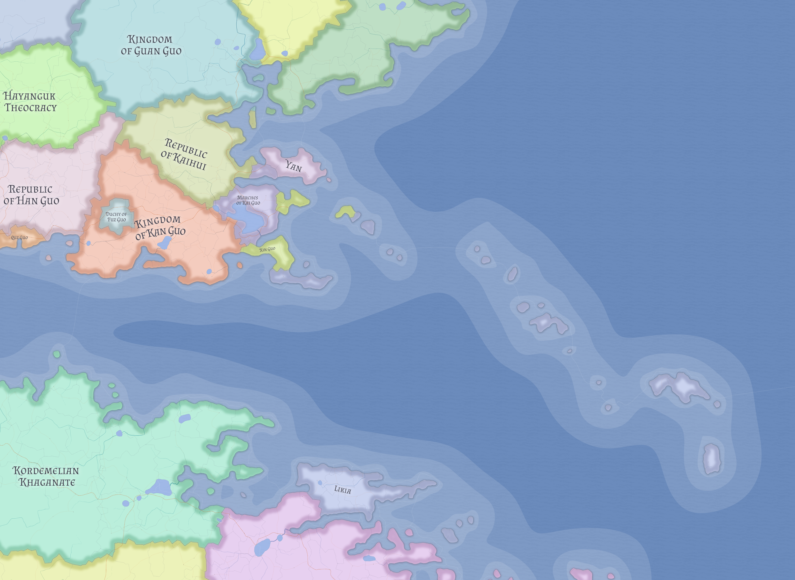

# Kaihui

Kaihui is a coastal republic in eastern Valthera, but it is best understood as a plains-and-pasture state rather than as a major maritime power. Its productive valleys, horse culture, and postwar political settlement matter more than the mere fact of its shoreline.

## Historical position

Kaihui was formerly the Kingdom of Kaihui. Before the Likian-Xin Guo war settlement, much of its outward trade moved through Xin Guo's ports rather than through a major Kaihuian maritime system of its own.

This made Kaihui an important material supporter of Xin Guo without making it a great naval power in its own right. Grain, livestock, and timber from Kaihui helped sustain Xin's war effort, and later Likian leniency toward Kaihui remained a source of resentment among Kaihuian elites rather than of gratitude.

## Geography and the port problem

Kaihui lies in eastern Valthera on the southeastern seaboard, facing the western waters of Oceanus Centralis. It sits south of [Guan Guo](guan-guo.md), north of [Kan Guo](kan-guo.md), east of [Han Guo](han-guo.md), and west of the wider Guan-Longlin-Tengc bay system.

Its interior of rolling plains, pasture, and fertile valleys is more important than its coast. Kaihui has more coastline than Guan Guo, but it lacks the developed port network needed to convert that coastline into comparable maritime leverage.

Current canon suggests the coast could have supported more significant harbor development, but that infrastructure was never built at scale because older Xin-linked maritime arrangements made it unnecessary. Kaihui is therefore coastal without being maritime-dominant.

One important southern outlet is mediated through [The Marches of Kai Guo](kai-guo.md), whose treaty structure keeps that corridor from becoming a unilateral Kaihuian asset.

## Economy

Kaihui is one of the major food-producing states of eastern Valthera. Its strength rests on agriculture, pastoralism, and horse breeding more than on seaborne commerce.

That productivity gives Kaihui broad regional importance because neighboring markets depend heavily on its grain. At the same time, the same abundance makes it an obvious target for stronger or more ambitious neighbors, especially [Kan Guo](kan-guo.md).

## Horses and social identity

Kaihui hosts the largest population of Valtheran Thoroughbreds in the world. Horses are not just an economic asset there, but a core part of national identity and everyday social organization.

This gives Kaihui a profile closer to a horse-people society than to a state where horses are merely an aristocratic prestige good. Export is tightly controlled, large-scale foreign sale is broadly disfavored, and horse milk traditions remain part of ordinary life.

Kaihui also includes a significant nomadic or semi-nomadic population, especially across the northern non-urban plains. Older horse-clan traditions therefore remain socially important even under republican constitutional language.

## Government and political culture

The Republic of Kaihui is publicly celebrated, especially among commoners, but much of the merchant class and aristocracy treats it as a foreign political system imposed after war. In practice, it is republican in name more than in sovereign emotional legitimacy.

The public face of the assembly is the **Prytanarch**, commonly mocked as **Kongzui**, or "empty mouth." Real executive leverage lies more heavily with the dual presidency of the **Zuozheng** and **Youzheng**, whose staggered four-year terms and veto power make them more consequential than the assembly's public symbolism alone would suggest.

Even so, the bureaucracy inherited from the old kingdom remains the state's most durable organ of government. Many rural communities continue to care more about local authority, lineage, and elders than about direct engagement with the formal republic.

## Religion

Kaihui's traditional religion is the worship of the **Xinchang Deities**, but religion is treated as a personal and household matter rather than as a strongly public civic performance. The relative absence of large visible temples should not be read as weak belief.

This restrained pattern distinguishes Kaihui from [Xin Guo](xin-guo.md), where the same religious world is treated more overtly as a public social contract.

## Foreign posture

Kaihui sees itself as protectionist, conservative, and fundamentally non-threatening. It is defensive rather than expansionist, and ordinary people do not necessarily remember the Likian war as Kaihui's own great national struggle.

The consequences of that war remain more vivid in administrative and elite memory than in popular consciousness. This helps explain why Kaihui publicly performs the postwar order while never fully embracing the legitimacy of the settlement that left it republican, under-ported, and strategically constrained.

## Place in Valthera

Kaihui is best understood as a proud pastoral-plains state living inside an external order it did not choose. It matters because food production, horse culture, and geographic scale give it enduring regional weight even though its coast does not translate into matching naval influence.

## Related

- [Valthera](../geography/valthera.md)
- [Guan Guo](guan-guo.md)
- [Han Guo](han-guo.md)
- [Kan Guo](kan-guo.md)
- [The Marches of Kai Guo](kai-guo.md)
- [See of Xin Guo](xin-guo.md)
- [Likia](likia.md)
