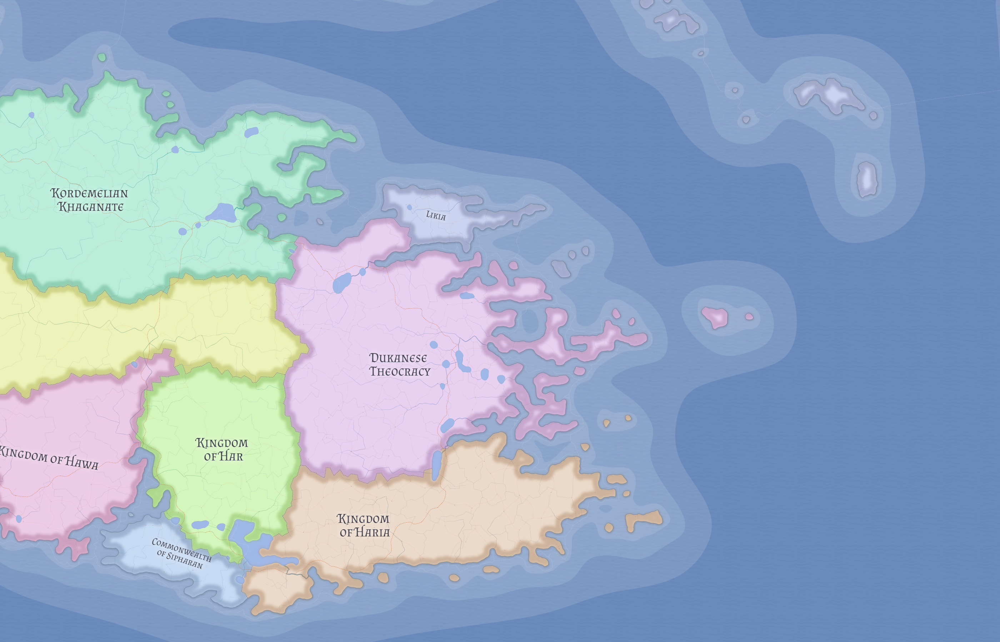

# Kan Guo

Kan Guo is a Chinese monarchy in eastern Valthera best understood as a relatively straightforward feudal kingdom. Its importance lies less in eccentric institutions than in the fact that it provides one of the clearest examples in the region of a durable landed crown-and-lords order.

## Political structure

Kan Guo should be read as a competent hereditary kingdom rather than as a republic, clan-confederation, or heavily unusual court system. Royal authority is strongest in strategic crown centers, while major hereditary nobles and lesser landed lords structure the wider realm.

Its political center is **Hejian**. The resulting order is not radically innovative, but that simplicity is part of its significance in a regional cluster where neighboring states are more structurally unusual.

## Place in eastern Valthera

Kan Guo sits south of [Kaihui](kaihui.md) and is one of the powers that gives the southeastern Valtheran lowlands their political weight. It is better understood as a landed monarchy than as a maritime state, even though it participates in coastal and regional exchange.

This makes Kan Guo a useful contrast case within eastern Valthera: a state whose strength comes from conventional dynastic and feudal continuity rather than from treaty-imposed republicanism, maritime humiliation, or archaic confederated imperial forms.

## Relationship with Kaihui

Kan Guo is one of Kaihui's most important neighbors and most obvious long-term threats. Kaihui's grain and plains make it valuable, and Kan Guo's more conventional monarchy gives it a different kind of regional posture from the republican shell to its north.

At the same time, the two states remain tied by trade and proximity. Kan Guo therefore matters to Kaihui not only as a danger, but as a necessary southern interlocutor in the broader southeastern Valtheran system.

That relationship also helps explain the continued importance of [The Marches of Kai Guo](kai-guo.md), whose treaty-bound neutrality prevents the southern outlet from becoming a simple instrument of either side.

## Fuz Guo within the kingdom

[Fuz Guo](fuz-guo.md) survives inside Kan Guo as an old semi-autonomous duchy whose historic privileges were never fully erased by later royal consolidation. That irregularity helps mark Kan Guo as an old monarchy with surviving feudal complexity rather than a perfectly rationalized state.

## Related

- [Valthera](../geography/valthera.md)
- [Kaihui](kaihui.md)
- [Fuz Guo](fuz-guo.md)
- [The Marches of Kai Guo](kai-guo.md)
- [Yan](yan.md)
- [See of Xin Guo](xin-guo.md)
