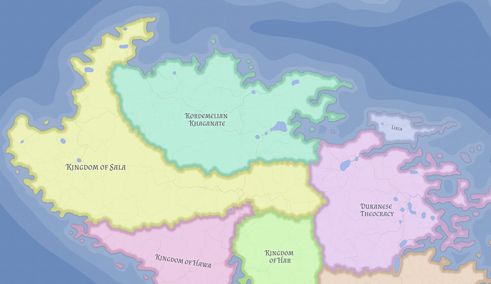

# Kordemelian Khaganate

The Kordemelian Khaganate is the largest state on Kasmora's northern coast by territory and one of its great demographic powers. It is Kordemelian in rule and identity even though many of its settlements are culturally Likian.

## Structure

The Khaganate is centered on **Dogu**, the largest single settlement in Kasmora. Its government remains Kordemelian in tone and authority, even across culturally mixed lands.

## Religious and cultural pattern

Kordemeli is divided between an Ayedist core and a large Skrosenist population concentrated in formerly Likian communities. This reflects territorial expansion and long-lived frontier incorporation rather than a flat national culture.

## Related

- [Ayedism](../religions/ayedism.md)
- [Kasmora](../geography/kasmora.md)
- [Likia](likia.md)
- [Sala](sala.md)
