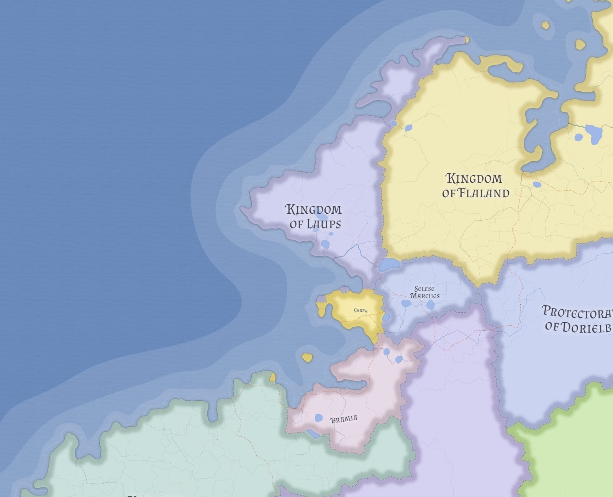

# Laups

Laups is a broad Flandric upland kingdom whose strength lies less in cities or maritime brilliance than in holding together a large hard country through a few strong royal nodes and a cohesive Skrosenist culture.

## Geography

Laups occupies a large northwestern shoulder of western Nereth, with a rough interior, an exposed coast, and a more workable southern hinge. Its royal capital, **Aldved**, sits at the strategic convergence point of the kingdom rather than at its largest commercial node.

## Social character

Laups is culturally and religiously coherent. Its challenges come less from internal diversity than from distance, sparse settlement, and the difficulty of ruling a large rough country through limited centers.

## Related

- [Garka](garka.md)
- [Skrosenism](../religions/skrosenism.md)
- [Western Maritime Nereth](../geography/western-maritime-nereth.md)
