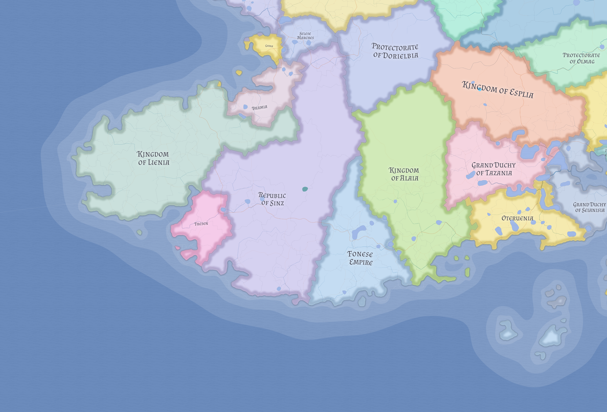

# Lienia

Lienia is the stable gateway monarchy of western Nereth: an English-led maritime kingdom whose power comes from turning oceanic trade into inland influence while ruling a broad and unevenly integrated territorial body.

## Core identity

Lienia is one of the two dominant western powers of Nereth and the clearest gateway monarchy in the western trade system. It is the principal landing point for Likian goods entering western Nereth.

Its strength lies less in naked conquest than in population, urban density, maritime access, customs control, and durable institutional success. Lienia should therefore be understood as a kingdom of functioning success rather than frontier instability or post-imperial crisis.

## Geography and maritime structure

Lienia is a broad maritime kingdom, not merely a port-state attached to its capital. Its power centers on **Bolcescast**, which sits at a narrow estuarial throat where movement can be watched, taxed, and organized.

The kingdom has four major geographic faces:

- the Bolcescast estuary core, where crown oversight and customs density are strongest
- the secondary northern and western coast, with older English coastal settlements and lesser ports
- the southern and southwestern littoral, rougher and more regionally textured
- the broad inland body, which supports the commercial system without receiving equal royal attention

## Cultural structure

Lienia is a composite kingdom rather than a flat English polity. Its internal pattern includes an English crown-and-coast core, a smaller Anglo-Saxon inland and upland belt, and a substantial German southern and southwestern bloc that includes towns and ports.

English culture provides the kingdom's main public identity. Anglo-Saxon culture is more rural and old-fashioned in mainstream Lienian eyes, while the German population is more commercially useful, politically self-aware, and more likely to imagine alternatives to English-led crown rule.

## Religion

Lienia's broad religious tone is **Skrosenist**, especially in the English and Anglo-Saxon zones. This ties it to the wider northwestern maritime world and helps explain part of its ease of connection to [Likia](likia.md) without making it a Nordic state.

A meaningful Germanist belt survives in the German regional bloc. Religion therefore gives the kingdom internal texture rather than eastern-style legitimacy crisis.

## Political order

Lienia is a crown-centered but unevenly reaching monarchy. It is strongest where direct control pays clear returns: the capital estuary, major ports, high-value roads, and politically sensitive mixed regions.

Much of the inland body is looser. There, daily order is mediated through local elites, burg authorities, priests, reeves, stewards, and customary practice. Lienia exemplifies Eutheria's broader pattern of preindustrial sophistication: politically intelligent and institutionally layered, but not uniformly present.

## Economy and security

Lienia benefits directly from the post-Veltric trade realignment in which Likian goods land in the west and move inland toward the dwarven passes. Customs, warehousing, secondary coasts, fisheries, inland agricultural support, and transport integration all contribute to its strength.

Its peace is best understood as corridor peace. Security is strongest at harbors, customs nodes, important roads, and major burgs, and thinner across large parts of the inland body.

## External relations

Lienia's most important outside relationship is with [Likia](likia.md), whose maritime system it helps translate into western continental power. Its second defining relationship is with [Sinz](sinz.md), the other great western power, harsher and more assertive than Lienia's steadier maritime monarchy.

## Internal regional pattern

Lienia is strongest at nodes and weaker in seams. Regions such as [Rombevenia](../geography/rombevenia.md) lie close to the estuarial-commercial core, while regions such as [Dudbury](../geography/dudbury.md) belong to the broad inland body where royal authority is real but more weakly felt in everyday life.

Dudbury matters to the kingdom less because it is unusual in itself than because **Malton** sits on the road leading south from Bolcescast into Sinz. Crown attention is therefore unevenly distributed: strongest where the corridor matters, thinner across the ordinary rural fabric away from it.

That inland distinction matters for the current campaign layer. [Thornwick](../places/thornwick.md), inside Dudbury, is a good example of how Lienia can remain civilized and recognizably ordered while still leaving local danger, shrine-memory, road trouble, and creature pressure for local society and local heroes to absorb first.

## Related

- [Dudbury](../geography/dudbury.md)
- [Likia](likia.md)
- [Nereth](../geography/nereth.md)
- [Rombevenia](../geography/rombevenia.md)
- [Sinz](sinz.md)
- [Thornwick](../places/thornwick.md)
- [Western Maritime Nereth](../geography/western-maritime-nereth.md)
