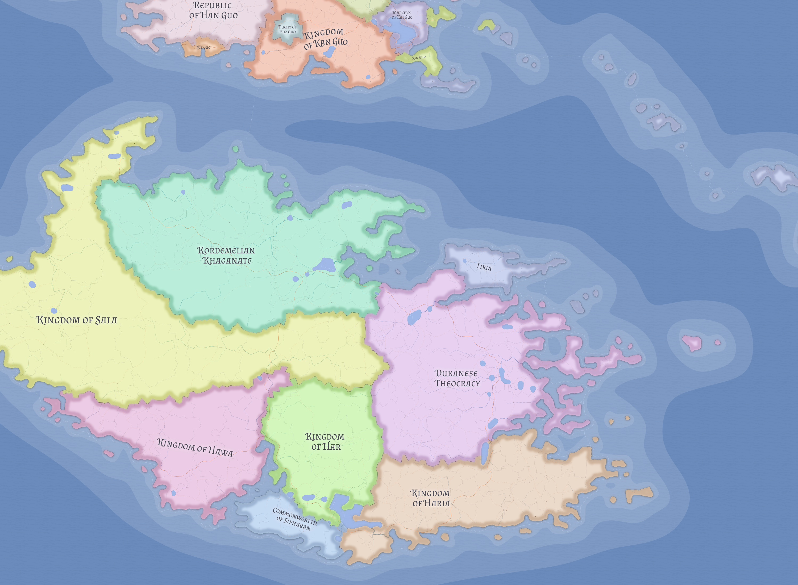

# Likia

Likia is the most strategically important naval state in Eutheria. Despite its modest territorial scale, its control of most of the Central Island Chain and a narrow strip of northern Kasmoran coast allows it to exert influence over intercontinental trade far out of proportion to its population or land area.

For the people and culture dimensions of this system, see [Likians](../peoples/likians.md) and [Likian Culture](../cultures/likian-culture.md).

Its power rests on geography before anything else. The islands and ports under Likian control sit across the principal maritime routes linking Valthera, Nereth, and Kasmora through Oceanus Centralis. As a result, Likia does not need to dominate the continents directly to shape continental politics. Control of passage, customs, convoy security, and naval access is enough.

## Historical position

Likia was founded at **0 LC (Likian Calendar)**, the peaceful formal declaration of independence that later became the chronological starting point used across much of the known world.

Its rise was gradual rather than explosive. Isolated from the Kasmoran agricultural interior by the northern mountain belt, the early Likian polity turned outward to the sea. Over time it expanded across the island chain, established fortified ports and naval bases, and transformed command of maritime routes into lasting political leverage.

Likia's dominance was tested most seriously during the long Likian-Xin Guo maritime rivalry. Current canon treats this as a centuries-long strategic contest rather than a single uninterrupted 450-year war. Valtheran expansion into Oceanus Centralis began around 200 to 300 LC, and from roughly 300 LC to 700 or 750 LC the rivalry took the form of intermittent naval wars, embargoes, proxy struggles, piracy, privateering, and competition over islands and trade routes. It culminated in a final major war in the eighth century LC, ending with Likian victory and the later creation of the See of Xin Guo, which established the cold peace that still governs much of Valthera's relationship with the strait.

## Government and internal politics

Likia is commercially dominant, politically stable, and strategically cautious. Its institutions are durable enough that outside powers often experience the state as predictable, but internally its politics are active and structured by organized factional competition rather than by unanimity.

A central feature of Likian society is the **guild system**. Guilds do more than regulate trade. They train professionals, set standards, arbitrate disputes, and provide ordinary Likians with practical protections in daily economic life. This gives the state an institutional depth that outsiders sometimes underestimate: Likian power does not depend on the fleet alone, but on the civic machinery that keeps the fleet supplied, financed, and socially embedded.

Likia is formally a principality with democratic elements in constitutional form but oligarchic realities in national practice. A hereditary patron from one of the founding houses nominates guildmasters to the governing council, holds tiebreaking authority, and shapes outcomes through influence rather than direct rule.

At present, no single political tendency governs uncontested. Administrative, mercantile, and military interests all matter, and policy emerges through bargaining among entrenched institutions rather than through simple personal rule. This helps explain both Likia's stability and its caution. The state is powerful, but it is powerful in ways designed to preserve an advantageous system rather than gamble it on reckless expansion.

Three recognizable factional blocs structure current politics:

- **Constitutionalists**: regulatory and administrative power-brokers who frame their dominance as defense of Likian constitutional order.
- **Mercantilists**: outward-looking commercial expansionists whose trade successes give them kingmaker influence.
- **Democrats**: hawkish cultural nationalists aligned more strongly with combat arms and recovery of Likian populations under Kordemelian rule.

## Religion and settlement pattern

Likian religion reflects the state's three-continent position. The island core is primarily **Skrosenist**, preserving the ancestral faith of the Nordic founders. The Kasmoran coastal territories are more strongly associated with **Kuhrizvansism**, while two Chinese-community settlements in Likian territory follow the **Xinchang Deities** tradition.

This layered map reflects historical depth rather than simple eclecticism: Nordic inheritance in the island chain, Kasmoran integration on the continental coast, and post-cold-peace commercial ties to Valtheran Chinese societies.

Likian settlement is also geographically dual. The island capital **Margaros** is the political and military center of the maritime order, while the city of **Likia** on the Kasmoran coast remains the original founding settlement and major commercial heart.

Likia should therefore not be imagined as a northern transplant that never changed. Its Nordic ancestry remains real, especially in relation to the northwestern maritime world, but its long residence in the strait has produced a mature hinge civilization shaped as much by central waters, trade, and composite settlement as by origin alone.

## Strategic significance

Likia's core advantage is control of sea routes across Oceanus Centralis. That advantage shapes the behavior of stronger territorial powers around it.

- Trade between Valthera and Kasmora moves under Likian observation or within waters Likia can influence.
- Naval challengers must contend not only with the Likian fleet but with fortified island positions and a maritime system built around patrol, logistics, and route control.
- Powers that dislike Likian dominance usually adapt to it rather than confront it directly, because the cost of bypassing the island chain is high in time, risk, and lost commercial efficiency.

This geographic leverage also creates constraints. Likia is strongest at sea, not on land. It can regulate passage and sustain blockade pressure, but it cannot easily conquer large continental neighbors. Likian strategy therefore tends to favor managed balances, commercial leverage, and selective coercion over direct territorial empire.

## Regional relationships

Likia's relationships with neighboring powers are shaped by geography and necessity.

**Kordemeli** is the immediate western land neighbor and the clearest illustration of Likian strategic limits. Kordemeli cannot easily destroy Likian sea power, while Likia cannot realistically reconquer major continental territories from so large a land state. The result is a tense but durable coexistence.

**Valthera** remains linked to Likia through the cold peace that followed the final Xin Guo defeat. Valtheran states trade through Likian-controlled waters under Likian terms, however unwillingly, including major republics such as [Han Guo](han-guo.md).

The defeated remnant of Xin Guo persists as the [See of Xin Guo](xin-guo.md), a religiously governed rump state legally prohibited from maintaining a navy.

**Haria** and **Hawa** matter because southern approach routes to the strait pass through waters they can influence. Even a naval power built on chokepoint control cannot treat the wider maritime system as politically empty.

**Lienia** in western Nereth has become one of Likia's most important commercial partners, especially since the disruption of older southern trade patterns after the Veltric collapse.

## Society and outlook

Likian society is maritime, urban-facing, and institutionally disciplined. The state is not large enough to waste people or resources casually, which reinforces habits of administration, technical competence, and long-term planning. Merchants, sailors, shipbuilders, customs officials, and guild professionals all occupy a more central social place than they would in many larger agrarian kingdoms.

This produces a characteristic Likian outlook: proud, pragmatic, and rarely sentimental about power. Likia prefers arrangements that can be maintained. It does not need universal admiration. It needs the routes to keep functioning under its terms.

## Related

- [Central Island Chain](../geography/central-island-chain.md)
- [World of Eutheria](../geography/world-of-eutheria.md)
- [Valthera](../geography/valthera.md)
- [Kasmora](../geography/kasmora.md)
- [Haria](haria.md)
- [Kingdom of Hawa](hawa.md)
- [Dukanese Theocracy](dukan.md)
- [Lienia](lienia.md)
- [See of Xin Guo](xin-guo.md)
- [Likian Culture](../cultures/likian-culture.md)
- [Likians](../peoples/likians.md)
