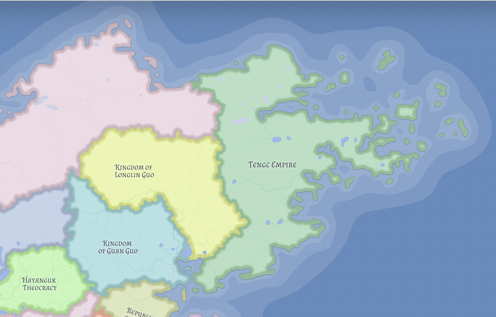

# Longlin Guo

Longlin Guo is a proud northern Tengcian kingdom whose meaningful life is concentrated in its southern river-facing belt rather than its far northern claimed expanse.

## River world

Longlin controls much of the middle course of the major river system that ultimately exits through Guan Guo's bay. That gives it real leverage over movement and cargo flow, even though it does not control the best maritime outlet.

## Constraint

The kingdom's frustration is structural: it matters greatly upstream, but geography denies it a clean downstream advantage.

Its northern and upland reaches are better understood as a resource frontier than as a densely integrated heartland, which makes the southern river-facing belt all the more important.

## Political tone

Longlin is best read as proud, upstream, and resistant to dependence. It has reason to cooperate with downstream partners, but little reason to feel relaxed about them.

## Related

- [Guan Guo](guan-guo.md)
- [Tengc Empire](tengc.md)
- [Valthera](../geography/valthera.md)
