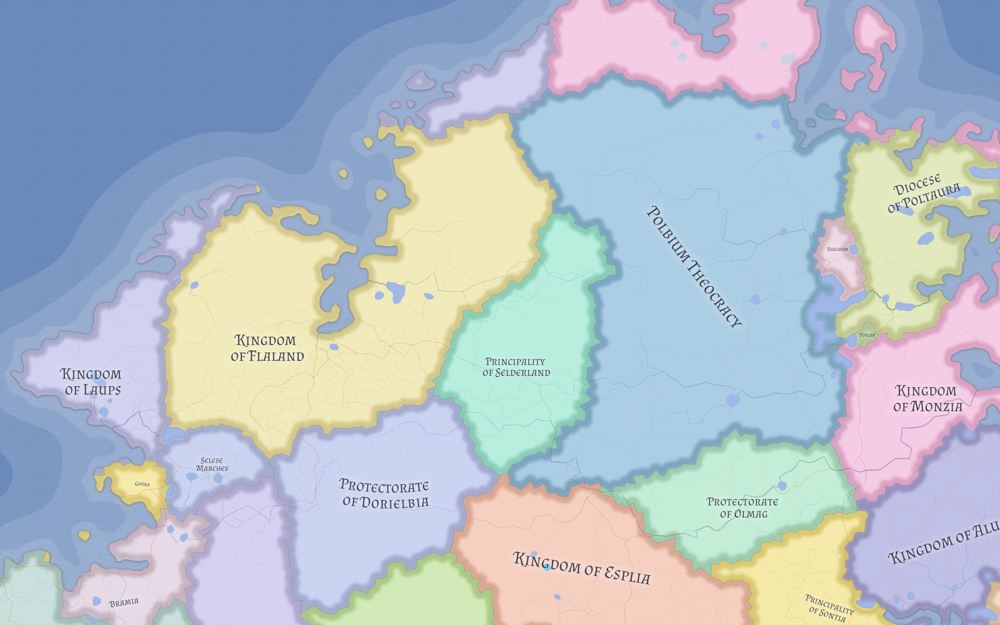

# Polbium Theocracy

The Polbium Theocracy is the largest Veltric successor state by area and the principal territorial claimant to the institutional inheritance of the [Rocciaganel Church](../religions/rocciaganel-church.md). Its importance comes from the way sacred authority, post-imperial legitimacy, and geographic continuity converge in one state.

## Marcici and legitimacy

Polbium contains [Marcici](../places/marcici.md), the old joint seat of both Emperor and Pontif. Because of that, the Theocracy presents itself not as a novel regime, but as the last lawful continuation of the old imperial core.

The primatial office of the Church therefore sits inside a state that claims both sacred and post-imperial legitimacy. Questions of ecclesiastical recognition and political allegiance are consequently difficult to separate.

## Institutional inheritance

Polbium wields influence beyond its borders because it can invoke Church continuity across former imperial territories. This gives it a form of soft power that exceeds raw territorial control:

- it can appeal to ecclesiastical legitimacy
- it can question rival claims to lawful succession
- it can mobilize religious sentiment across political borders

## Present challenge

The Theocracy is not secure in a simple sense. It is fighting a difficult rearguard action in a world where older Roman traditions are resurgent, the post-imperial order is contested, and Church authority no longer rests on imperial backing.

Polbium is therefore powerful but embattled: a state whose authority still matters widely, yet is increasingly challenged even in the regions where it expects obedience most strongly.

## Related

- [Age of Fracture](../history/age-of-fracture.md)
- [Eastern Nereth Religious Landscape](../religions/eastern-nereth-religious-landscape.md)
- [Marcici](../places/marcici.md)
- [Rocciaganel Church](../religions/rocciaganel-church.md)
