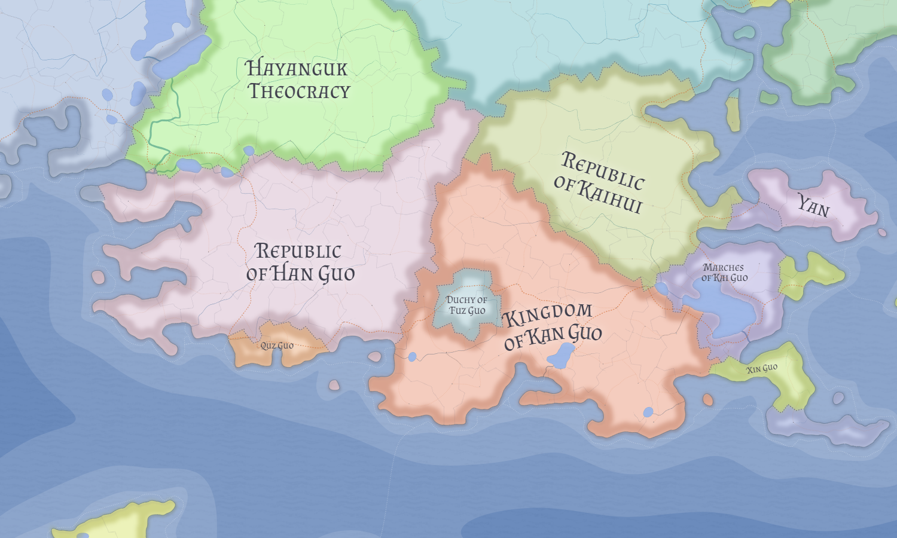

# Quz Guo

Quz Guo is a small sovereign Chinese Taizhouist state centered on **Shang**, widely recognized as the birthplace of Taizhouist philosophy and religion.

It predates [Han Guo](han-guo.md) and is best understood as an older sacred city-state rather than a later constitutional subdivision of the republic.

## Sacred sovereignty

Quz Guo's continuing independence is explained primarily by sacred status rather than military weight. In canon framing, reducing Shang to ordinary provincial administration would diminish the standing of a core Taizhouist holy center.

This gives Quz Guo a distinctive profile: politically small, ritually central, and protected in part because surrounding powers treat its autonomy as religiously meaningful.

## Government and external security

Quz Guo is formally sovereign and governs itself internally. Its external security, however, depends heavily on Han Guo.

This arrangement should not be read as simple protectorate convenience. It reflects a normative order in which the larger republic accepts custodial obligations toward sacred space while leaving local sacred governance intact.

## Relationship with Han Guo

Han Guo's protection of Quz Guo is treated as a religious duty, not merely treaty mechanics. The resulting regional structure is dual but coherent: **Insan** functions as the political capital of the republic, while **Shang** functions as a sacred center of the wider Taizhouist world.

In practice, this model allows political centralization and sacred autonomy to coexist without requiring either complete absorption or full strategic isolation. Quz Guo is therefore best understood not as an anomalous microstate, but as a sacred polity whose independence is preserved because full absorption would diminish the status of Shang itself.

## Current limitations

Several encyclopedia-level details remain open, including:

- internal governing institutions and clerical-civic balance
- territorial extent beyond the Shang-centered core
- formal legal basis of Han Guo security guarantees
- diplomatic relations with non-Taizhouist neighbors

## Related

- [Han Guo](han-guo.md)
- [Valthera](../geography/valthera.md)
- [Taizhouism](../religions/taizhouism.md)
