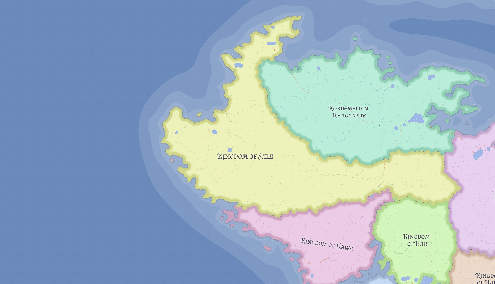

# Sala

Sala is the most expansionist state in Kasmora and one of the central Ayedist powers of the continent. Its strategic importance comes not only from land and trade, but from control of access to [Tuwaid](../places/tuwaid.md), the holiest site of Ayedism.

## Power and identity

Sala is a Salan kingdom with a strong Ayedist core and a long history of stable interaction with neighboring Kordemelian communities. Its capital, **Jalim**, is a major commercial hub with heavy maritime orientation.

Sala's high expansionism suggests a kingdom pursuing growth through commercial and maritime leverage more than through simple land conquest. It is not merely an inland pilgrimage monarchy, but a state able to turn sacred access and coastal trade into broader political weight.

## Pilgrimage and diplomacy

Because Sala controls the approach to Tuwaid, it possesses enormous soft power. Access is usually open, but the kingdom can use pilgrimage control as a diplomatic instrument when needed.

Its relationship with [Kordemelian Khaganate](kordemeli.md) is one of managed interdependence. Centuries of cross-border settlement show real stability, but Sala's control of Ayedist sacred geography gives it leverage the Khaganate cannot fully escape.

## Related

- [Ayedism](../religions/ayedism.md)
- [Hawa](hawa.md)
- [Kordemelian Khaganate](kordemeli.md)
- [Tuwaid](../places/tuwaid.md)
