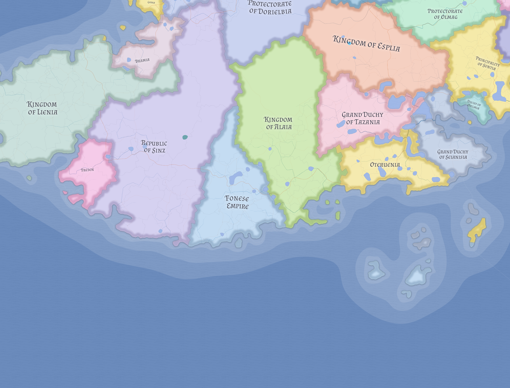

# Sinz

Sinz is the harder inland-commercial power of western Nereth: a patrician republic whose strength lies in corridor control, customs leverage, and the governable routes that connect western maritime trade to inland systems.

## Political character

Though formally a republic, Sinz is not a loose merchant league. It is a territorial, magistrate-heavy state with real coercive capacity, strongest at roads, customs points, provincial hearts, and high-value corridor zones.

## Historical place

Sinz emerged in 934 LC when the larger inland body of the old western kingdom broke with the crown and reorganized as a republic, while the ruling dynasty retained the coastal remnant that became [Fresen](fresen.md).

## Related

- [Bramia](bramia.md)
- [Fresen](fresen.md)
- [Fon](fon.md)
- [Lienia](lienia.md)
- [Western Maritime Nereth](../geography/western-maritime-nereth.md)
