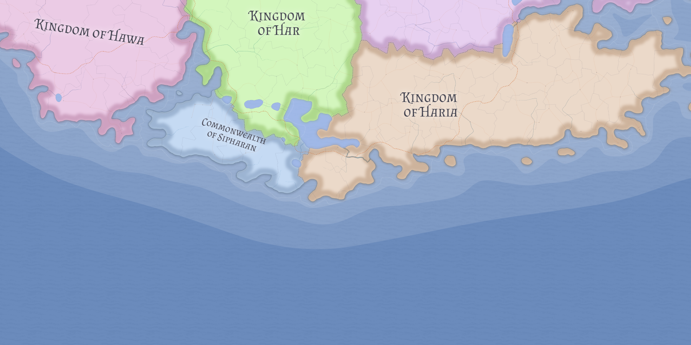

# Sipharan

Sipharan is the most politically distinctive state in Kasmora: a small commonwealth of self-governing republics, cantons, territories, and associated communities bound together by federal agreement rather than monarchy.

## Political form

Sipharan is not a smaller version of [Har](har.md). It is a structurally different polity whose autonomy is sustained by internal cohesion, defensive caution, and the fellowship-based social infrastructure of its Rawran Society tradition.

## Cultural uniformity

The commonwealth is exceptionally homogeneous in both culture and religion. That uniformity helps explain how autonomous communities can maintain a functioning shared political order without a monarchic center.

## Related

- [Har](har.md)
- [Kasmora](../geography/kasmora.md)
