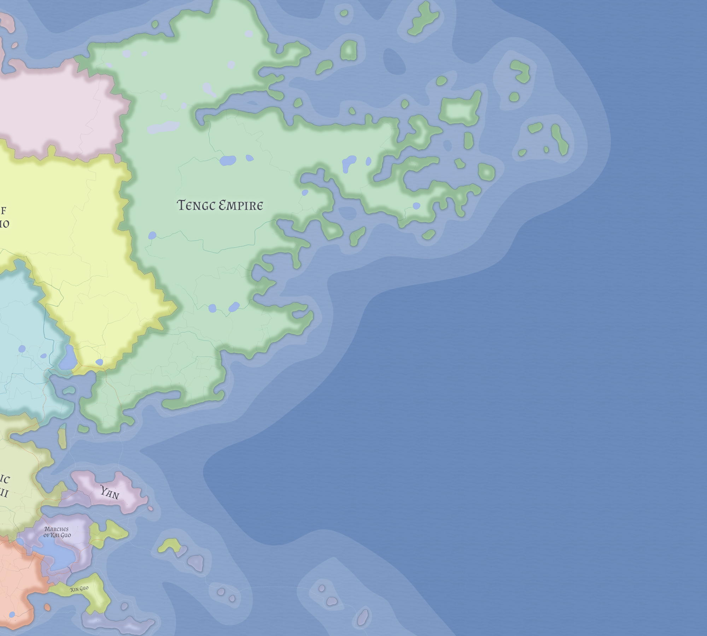

# Tengc Empire

Tengc is a large Tengcian state on the northeastern seaboard of eastern Valthera. Its imperial title reflects antiquity, prestige, and seniority more than dense administrative integration or overwhelming material power.

## Geography

Tengc's settled core lies in its southern and southeastern coastal belt. Farther north and northeast, it expands into colder, thinner frontier lands more easily claimed than deeply governed.

## Character

It is best understood as a northern coastal confederation with an older clan-based structure, not as a classic agrarian empire.

## Related

- [Guan Guo](guan-guo.md)
- [Kaihui](kaihui.md)
- [Longlin Guo](longlin-guo.md)
- [Valthera](../geography/valthera.md)
