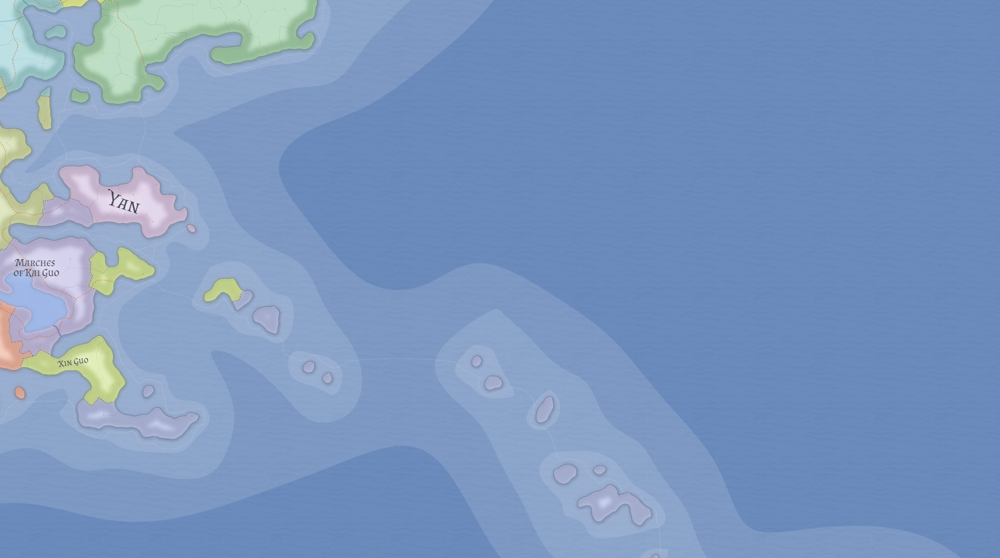

# See of Xin Guo

The See of Xin Guo is a small religiously governed state on Valthera's coast. It is the surviving remnant of the former Kingdom of Xin Guo, once the principal Valtheran naval challenger to [Likia](likia.md) in the long struggle for control of Oceanus Centralis.

## From defeated kingdom to clerical remnant

The old Kingdom of Xin Guo was the great Valtheran naval rival to Likia. After Likian victory in the eighth century LC, the kingdom was dissolved, prohibited from naval restoration, and replaced by a new order.

Likia did not design the See's mature internal structure in detail. The present church-state is better understood as an indigenous post-defeat reconstruction shaped by Xin Guo's surviving religious and administrative elites under the constraints of defeat.

## Geography and present condition

The See lies in eastern Valthera on the southeastern seaboard, facing the western waters of Oceanus Centralis. It is a small insular-and-coastal remnant rather than a deep territorial state.

Its geography remains strongly maritime in orientation, but it no longer has the scale or depth to function as a true naval power. It is best understood as a sea-born remnant whose coast now supports communication, diplomacy, and exposure more than maritime dominance.

## Government and leadership

The See is a true church-state rather than a monarchy with priests layered on top. Its supreme hierarch is the **Zhadrin**, while the senior clerical council and governing bureaucracy of the state is the **Khashung**.

The ideal ruler of the See is a true cleric recognized by the senior clergy as spiritually fit to hold the office. If no such figure can be acknowledged, authority reverts provisionally to the Khashung until one is recognized.

## Clergy, education, and influence

Across much of eastern Valthera, clergy are among the principal educators. This gives the See influence beyond its own territory through schools, tutors, texts, trained clergy, and the habits of literate court society.

That influence is never uniform. What clergy may teach is shaped by the states in which they work. The See's soft power is therefore strongest in capitals, courts, and urban settings where education and confessional prestige matter most.

## Diplomacy and intelligence

The See's frustrated outward impulse now expresses itself through doctrine, diplomacy, confessional influence, and intelligence rather than fleets.

Its priest-diplomats are among the most distinguished in the world, and its intelligence networks grow organically from correspondence, teaching, archives, missions, and clerical presence across Xinchang communities rather than from a wholly separate rogue apparatus.

## Religion abroad

Within the See itself, worship of the Xinchang Deities is treated as a public, socially organizing, and institutionally supervised order. The See seeks to make itself the arbiter of Xinchang orthodoxy abroad.

This gives it a particular interest in polities such as [Kaihui](kaihui.md), where the same religious world is practiced more privately and household-by-household. In Kaihui, the See has won some influence in elite and capital circles through education, etiquette, and formal recognition, but it has not succeeded in deeply socializing the faith across the wider population.

## Tone and significance

The See is sincere and political at the same time. Its highest clerics may be genuine exemplars of disciplined religious devotion, even while the wider ecclesiastical state operates through bureaucracy, diplomacy, and intrigue.

It matters less for raw power than for memory, grievance, and the redirection of a defeated maritime civilization into clerical and ideological forms.

## Related

- [Likia](likia.md)
- [Kaihui](kaihui.md)
- [Kan Guo](kan-guo.md)
- [Valthera](../geography/valthera.md)
- [Chronology of Eutheria](../history/chronology-of-eutheria.md)
