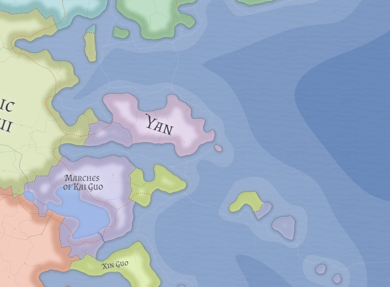

# Duchy of Yan

Yan is a minor coastal duchy on eastern Valthera's southeastern seaboard. It is a legitimate polity rather than a fiction of the map, but its survival depends more on caution, cohesion, and modesty than on regional power.

## Historical position

Yan preserves the remnant legitimacy of an older kingdom whose fuller history is now largely lost. The ducal house survives as the inheritor of that older order, even though the wider kingdom that produced it no longer exists.

Its endurance through the Likian-Xin wars appears to owe much to smallness. Yan was too minor to justify major intervention by the great powers and therefore survived by remaining respectable, self-contained, and strategically unprovocative.

## Political tone

The duchy is more self-important at home than it is important abroad. That inward ceremonial dignity should not be treated as fraud or delusion; it is part of how the ruling house maintains coherence, hierarchy, and legitimacy among its own subjects and retainers.

Yan is proud at home and cautious abroad. It does not press extravagant claims on stronger neighbors and is not built for regional competition.

## Economy and defense

Fishing, fish processing, small-scale coastal shipping, harbor service trades, and modest inland agriculture define the duchy's economy. **Dengzhou** is its fortified harbor and principal port.

Yan's military capacity is limited and defensive: harbor guards, ducal retainers, coastal watch forces, and a small patrol capability rather than a serious fleet or field army.

## Religion

Yan is conventionally Xinchang in practice, but it is not notably household-centered in the Kaihui manner and is not eager to accept strong outside clerical direction from the See of Xin Guo. Its religious life is better understood as inherited, local, and politically unexciting than as aggressively systematized.

## Related

- [The Marches of Kai Guo](kai-guo.md)
- [Kaihui](kaihui.md)
- [Kan Guo](kan-guo.md)
- [See of Xin Guo](xin-guo.md)
- [Valthera](../geography/valthera.md)
- [Eastern and Southeastern Valthera](../geography/eastern-southeastern-valthera.md)
